<p align="center">
  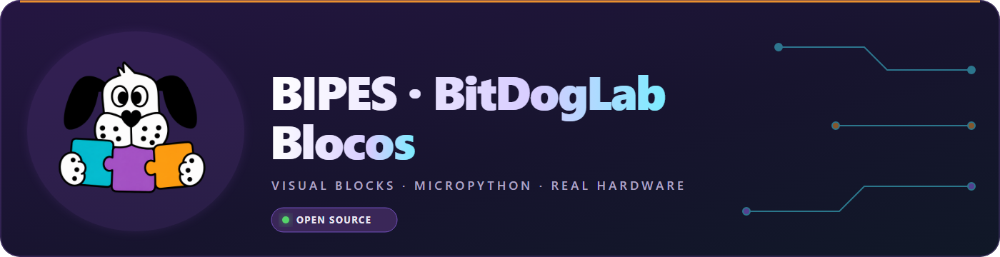
</p>

<p align="center">
  <strong>Português</strong> · <a href="README.en.md">English</a> · <a href="README.es.md">Español</a>
</p>

<p align="center">
  
  
  
  
</p>

<p align="center"><strong>Programação visual tangível: a criança monta blocos, gera MicroPython e vê o resultado acontecer no hardware real.</strong></p>

## O projeto

O **BIPES BitDogLab Blocos** é uma plataforma educacional open source baseada em Blockly para ensinar programação, eletrônica e pensamento computacional com a placa BitDogLab e o Raspberry Pi Pico W. Ela roda no navegador, transforma blocos conectados em MicroPython organizado e envia o programa à placa por USB usando Web Serial.

O foco do projeto é a **tangibilidade**: os blocos usam linguagem direta, ícones e ações ligadas aos periféricos reais. Acender um LED, ler um botão, mostrar um valor no OLED ou criar uma animação na matriz deve continuar compreensível antes mesmo de a criança conhecer a sintaxe Python.

## A interface em ação

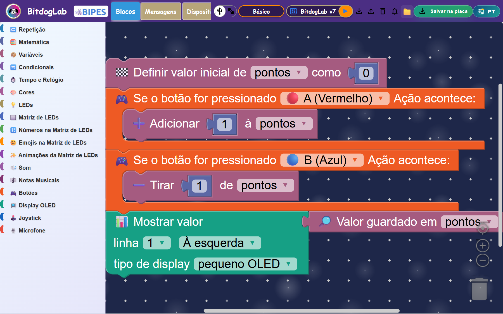

O exemplo acima combina uma variável de pontos, os botões A e B e o display OLED. Os blocos permanecem conectados como um programa executável, enquanto as categorias ficam sempre visíveis à esquerda.

<table>
  <tr>
    <td width="50%" align="center"><strong>Categorias e blocos tangíveis</strong></td>
    <td width="50%" align="center"><strong>Modos de projeto</strong></td>
  </tr>
  <tr>
    <td>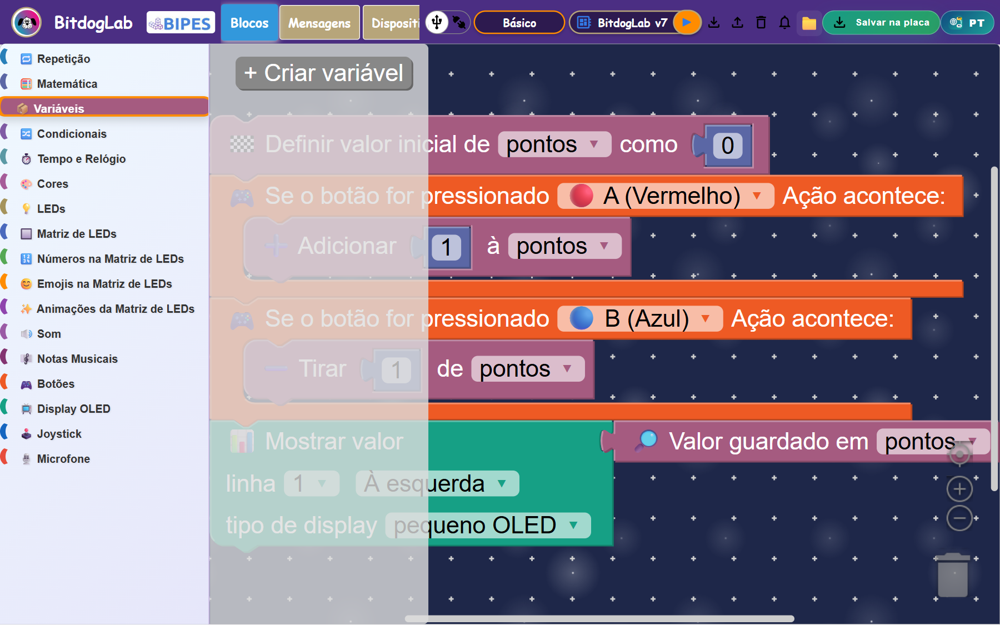</td>
    <td>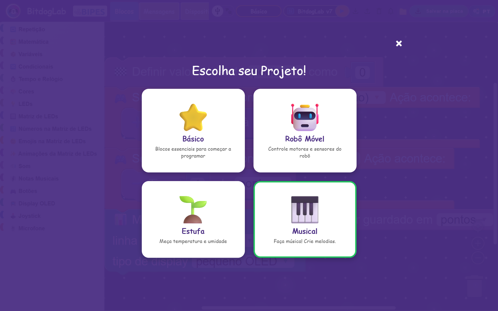</td>
  </tr>
</table>

Hoje a toolbox reúne **25 categorias**, filtradas conforme o projeto escolhido:

- **Básico:** lógica, repetição, matemática, variáveis, tempo, cores e todos os periféricos integrados.
- **Robô Móvel:** motores, movimento, inclinação e bateria.
- **Estufa:** verificação de sensores, temperatura, umidade e gráficos.
- **Piano Musical:** controle musical e geração de melodias para o buzzer.

## Da ideia ao MicroPython

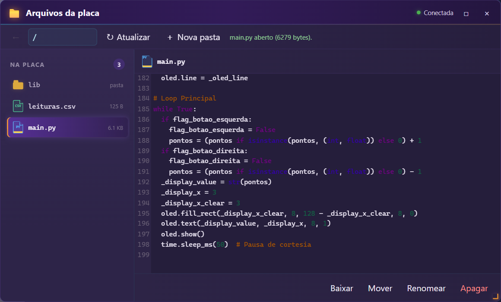

Cada bloco possui uma definição visual e um gerador. Antes da geração, contratos verificam conexões obrigatórias e apresentam avisos educativos. O código final separa importações, configuração e o laço principal:

```python
pontos = 0

while True:
    if flag_botao_esquerda:
        pontos = pontos + 1
    if flag_botao_direita:
        pontos = pontos - 1
    oled.text(str(pontos), 3, 8)
    oled.show()
```

O programa pode ser executado diretamente, salvo como `main.py` ou inspecionado na própria plataforma.

## Hardware que ganha vida

<p align="center">
  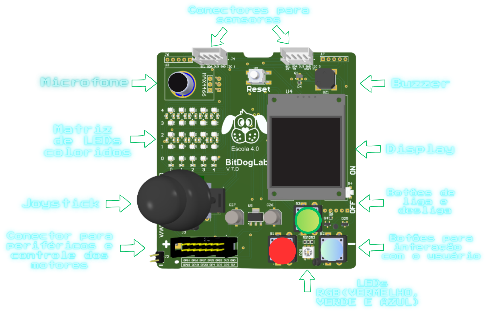
</p>

Os blocos cobrem LED RGB, matriz RGB 5×5, OLED, joystick, botões, buzzer, notas musicais, microfone, sensores e recursos específicos dos projetos Robô e Estufa. A interface oferece configurações para BitDogLab v6 e v7.

## Arquivos dentro da placa

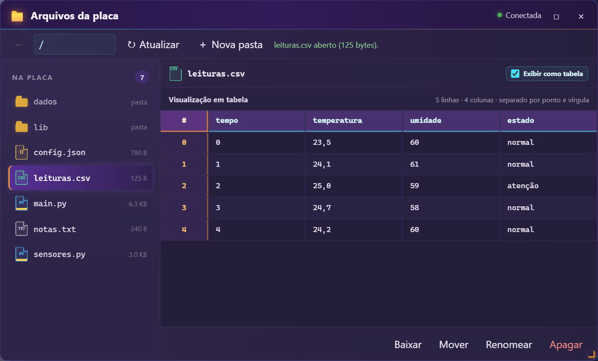

O gerenciador permite navegar por pastas, abrir, baixar, mover, renomear e apagar arquivos da placa. Arquivos CSV podem ser vistos automaticamente como uma planilha com cabeçalhos e índices, ou como texto original. A implementação está documentada em [`device-file-manager/README.md`](device-file-manager/README.md).

## Exemplos prontos para aprender e remixar

O repositório contém **56 projetos XML conectados**, acompanhados por imagens de validação. Eles podem servir como aula, ponto de partida ou teste de regressão.

<table>
  <tr>
    <td align="center"><strong>Semáforo</strong></td>
    <td align="center"><strong>Contador com variável</strong></td>
    <td align="center"><strong>Arco-íris</strong></td>
  </tr>
  <tr>
    <td>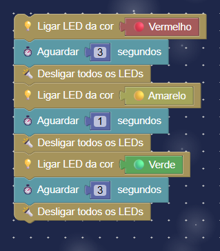</td>
    <td>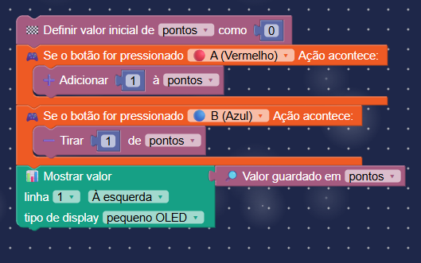</td>
    <td>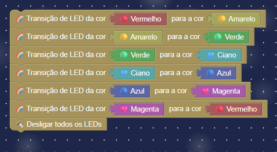</td>
  </tr>
</table>

## Arquitetura geral

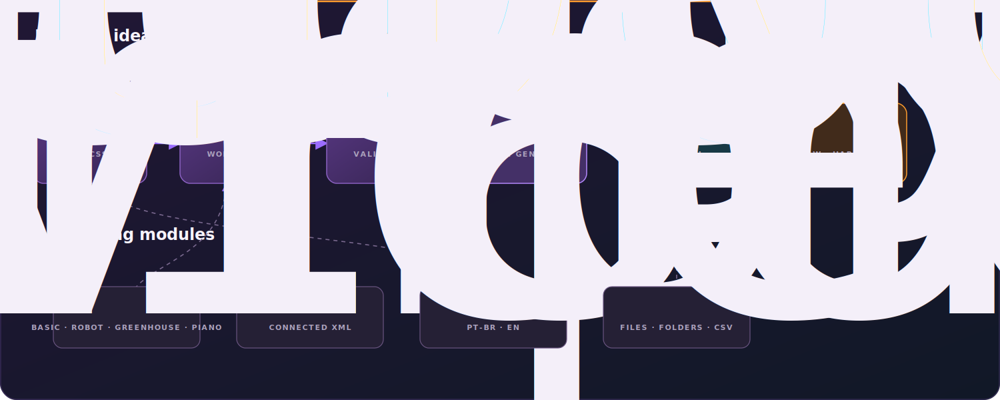

O fluxo principal é simples: a interface entrega os blocos ao workspace Blockly, os contratos validam o programa, os geradores produzem MicroPython e a camada WebSerial conversa com a placa. Modos de projeto, exemplos, traduções e o gerenciador de arquivos complementam esse fluxo sem misturar responsabilidades.

## Tecnologias

| Tecnologia | Uso no projeto |
| --- | --- |
| HTML5, CSS3 e JavaScript | Interface web, organização e comportamento da aplicação. |
| Blockly | Workspace, encaixe e serialização dos blocos. |
| MicroPython | Código executado no Raspberry Pi Pico W. |
| Web Serial API | Comunicação USB com o REPL da placa. |
| CodeMirror | Visualização de Python, textos e CSV original. |
| xterm.js | Console serial dentro do navegador. |
| Playwright | Validação automatizada e capturas da interface. |

A aplicação não depende de um backend para funcionar. O navegador serve a interface e conversa diretamente com o dispositivo autorizado pelo usuário.

## Organização do repositório

```text
BIPES-BITDOGLAB/
├── src/
│   ├── pages/                 # páginas da aplicação
│   ├── styles/                # identidade visual e layout
│   ├── js/
│   │   ├── blocks/            # definições, geradores e contratos
│   │   ├── communication/     # WebSerial e canais
│   │   ├── config/            # toolbox e versões da BitDogLab
│   │   ├── core/              # workspace, geração e inicialização
│   │   └── ui/                # componentes da interface
│   └── translations/          # interface em PT-BR e inglês
├── device-file-manager/       # arquivos e pastas da placa
├── Examples/                  # projetos XML conectados
├── images/                    # imagens dos exemplos e do README
├── micropython/               # referências e exemplos MicroPython
├── firmware/                  # bibliotecas auxiliares para a placa
├── docs/                      # guias, checklists e documentação técnica
└── tests/                     # validações automatizadas locais
```

## Executar localmente

Você precisa de Chrome ou Edge em um computador, um cabo USB de dados e a BitDogLab com MicroPython instalado.

```bash
git clone https://github.com/BitDogLab-Blocos/BIPES-BITDOGLAB.git
cd BIPES-BITDOGLAB
python -m http.server 5500
```

Abra `http://127.0.0.1:5500`, escolha o modo do projeto, conecte a porta serial e monte seu programa. O aplicativo em si não exige `npm install`; as dependências Node são usadas apenas pelas ferramentas de validação.

> Web Serial exige uma ação explícita do usuário para escolher a porta. Use `localhost`, `127.0.0.1` ou uma origem HTTPS.

## Open source de verdade

Contribuições de professores, estudantes, makers e desenvolvedores são bem-vindas. Você pode:

- relatar um problema ou propor uma experiência educacional;
- melhorar a linguagem e a acessibilidade dos blocos;
- criar definição, gerador, contrato e exemplo conectado para um novo bloco;
- testar em hardware real e compartilhar os resultados;
- traduzir documentação ou revisar materiais de aula.

Ao contribuir, preserve a tangibilidade, mantenha cada responsabilidade em seu módulo e inclua um exemplo que outra pessoa consiga abrir e executar.

## Origem e licença

Este trabalho é baseado no [BIPES](https://bipes.net.br/), criado por Rafael Vidal Aroca e colaboradores, e evolui com a comunidade BitDogLab Blocos. O código é distribuído sob a [GNU General Public License v3.0](LICENSE): use, estude, modifique e compartilhe mantendo as mesmas liberdades.
