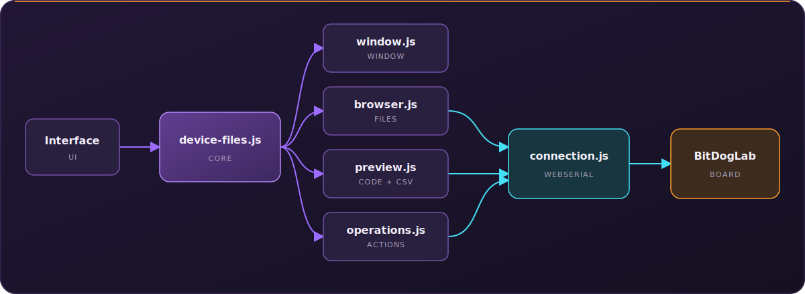

# Gerenciador de arquivos da BitDogLab

**Português** · [Read in English](README.en.md)

Esta pasta contém uma janela independente para visualizar e organizar os arquivos gravados na placa. Ela usa a conexão WebSerial já existente no projeto e não altera a arquitetura principal do BIPES.


_Exemplo da janela no estado conectado; os arquivos exibidos variam conforme o conteúdo de cada placa._

Quando a placa está conectada, é possível navegar por pastas, abrir, baixar, mover, renomear e apagar arquivos. Arquivos CSV são organizados automaticamente como uma planilha, mas também podem ser vistos como texto original.

## Arquitetura



O arquivo principal cria a interface e mantém o estado compartilhado. Os outros módulos adicionam somente as funções de sua responsabilidade.

| Arquivo | Responsabilidade |
| --- | --- |
| `device-files.js` | Cria a janela, guarda o estado e registra os eventos principais. |
| `window.js` | Abre, fecha, move, maximiza e redimensiona a janela. |
| `connection.js` | Envia comandos pelo WebSerial e interpreta as respostas da placa. |
| `browser.js` | Lista arquivos, navega entre pastas e escolhe os ícones. |
| `preview.js` | Abre textos e mostra arquivos CSV como tabela ou conteúdo original. |
| `operations.js` | Baixa, move, renomeia, apaga e cria pastas. |
| `device-files.css` | Define o visual minimalista e neon da janela. |

## Como é iniciado

Após todos os módulos serem carregados em `src/pages/index.html`, apenas uma instância é criada:

```js
var Files = new DeviceFilesManager('#fileList');
```

Os módulos complementares usam a extensão oferecida pela classe principal:

```js
DeviceFilesManager.extend({
  minhaAcao() {
    // Função específica deste módulo.
  }
});
```

Por isso, `device-files.js` deve ser carregado antes de `window.js`, `connection.js`, `browser.js`, `preview.js` e `operations.js`.

## Fluxo básico

1. A criança abre a janela pelo ícone de pasta.
2. `browser.js` solicita a lista de arquivos.
3. `connection.js` conversa com a BitDogLab.
4. O arquivo escolhido é enviado para `preview.js`.
5. Alterações como mover ou apagar passam por `operations.js`.

> `main.py` e `boot.py` participam da inicialização da placa. As operações exibem avisos adicionais para esses arquivos.
