# Joystick examples

[Read in Portuguese](README.md) · [English](README.en.md)

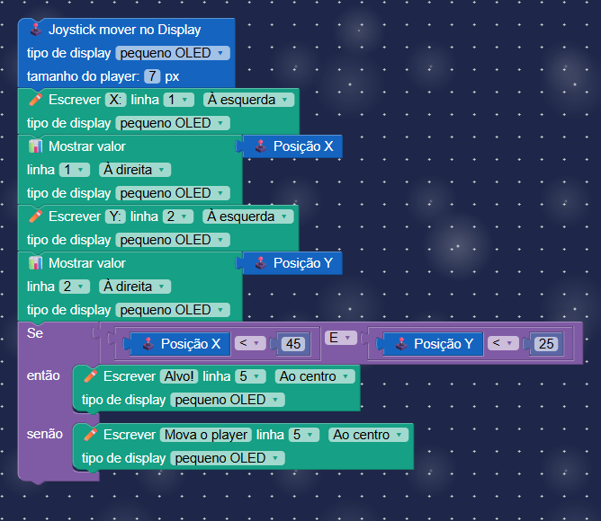

This collection contains **16 connected projects** for exploring the BitDogLab joystick with blocks. The examples start with simple actions—controlling LED brightness and buzzer frequency—and progress to OLED interfaces, drawing, the LED matrix, selectors, and games.

## How to use

Open the application, load any `.xml` file from this folder into the Blockly workspace, and run it or generate MicroPython. The images below show the block arrangement for each project; click an image or its name to open the XML file.

The joystick uses the analog axes **GPIO 27 (X)** and **GPIO 26 (Y)**, plus the center button on **GPIO 22**. The BitDogLab v6 or v7 configuration applies the correct axis orientation.

## Collection

<table>
  <tr>
    <td width="50%" valign="top">
      <a href="01_led_brilho_com_direcoes.xml">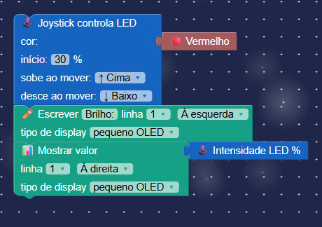</a>
      <strong>01 — LED brightness with directions</strong> 
      Increase or reduce the red LED brightness by moving the joystick up or down. 
      <a href="01_led_brilho_com_direcoes.xml">Open XML</a>
    </td>
    <td width="50%" valign="top">
      <a href="02_led_intensidade_no_oled.xml">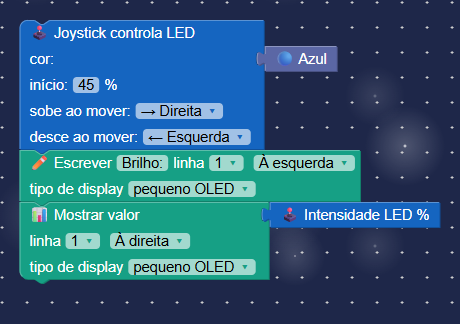</a>
      <strong>02 — LED intensity on OLED</strong> 
      Control the blue LED and show its current intensity on the OLED display. 
      <a href="02_led_intensidade_no_oled.xml">Open XML</a>
    </td>
  </tr>
  <tr>
    <td valign="top">
      <a href="03_led_faixa_de_brilho.xml">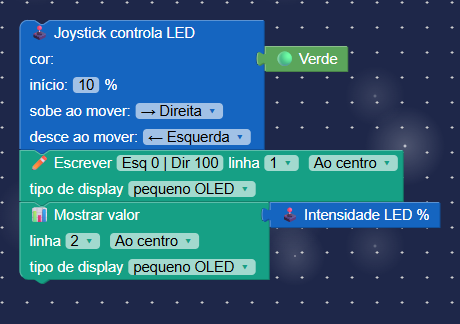</a>
      <strong>03 — Brightness range</strong> 
      Turn joystick movement into a continuous brightness value from 0 to 100%. 
      <a href="03_led_faixa_de_brilho.xml">Open XML</a>
    </td>
    <td valign="top">
      <a href="04_buzzer_frequencia_com_direcoes.xml">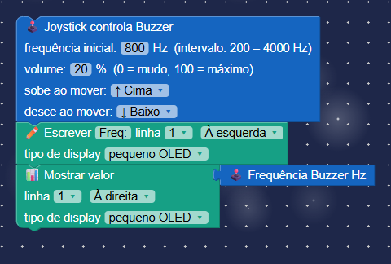</a>
      <strong>04 — Buzzer frequency with directions</strong> 
      Increase or reduce the buzzer frequency between 200 and 4000 Hz. 
      <a href="04_buzzer_frequencia_com_direcoes.xml">Open XML</a>
    </td>
  </tr>
  <tr>
    <td valign="top">
      <a href="05_buzzer_frequencia_no_oled.xml">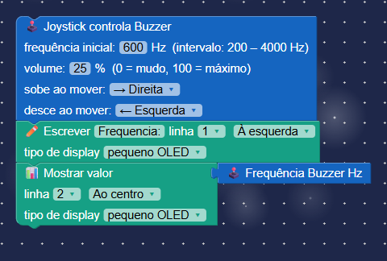</a>
      <strong>05 — Frequency on OLED</strong> 
      Control the buzzer and track its current frequency on the display. 
      <a href="05_buzzer_frequencia_no_oled.xml">Open XML</a>
    </td>
    <td valign="top">
      <a href="06_player_movido_no_oled.xml">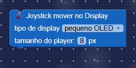</a>
      <strong>06 — Player moved on OLED</strong> 
      Move a square across the screen without letting it cross the edges. 
      <a href="06_player_movido_no_oled.xml">Open XML</a>
    </td>
  </tr>
  <tr>
    <td valign="top">
      <a href="07_player_com_coordenadas.xml">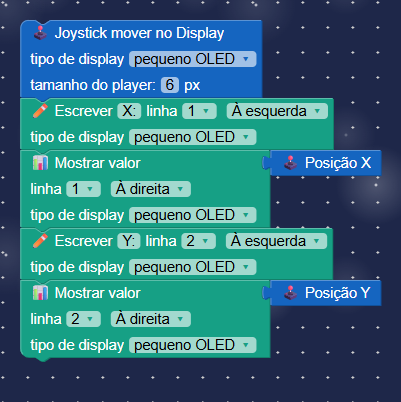</a>
      <strong>07 — Player with coordinates</strong> 
      Move the player and display its X and Y positions on the OLED. 
      <a href="07_player_com_coordenadas.xml">Open XML</a>
    </td>
    <td valign="top">
      <a href="08_lousa_magica.xml">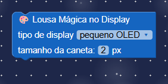</a>
      <strong>08 — Magic canvas</strong> 
      Draw a persistent trail on the display by moving the joystick. 
      <a href="08_lousa_magica.xml">Open XML</a>
    </td>
  </tr>
  <tr>
    <td valign="top">
      <a href="09_lousa_com_coordenadas.xml">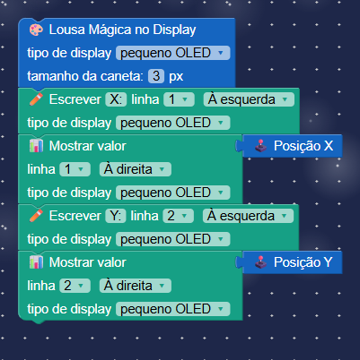</a>
      <strong>09 — Canvas with coordinates</strong> 
      Draw freely and show the cursor's current coordinates. 
      <a href="09_lousa_com_coordenadas.xml">Open XML</a>
    </td>
    <td valign="top">
      <a href="10_cursor_na_matriz.xml">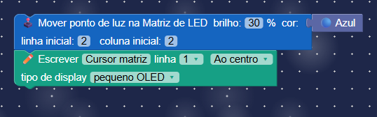</a>
      <strong>10 — Cursor on the matrix</strong> 
      Move a point around the 5×5 RGB grid using the four directions. 
      <a href="10_cursor_na_matriz.xml">Open XML</a>
    </td>
  </tr>
  <tr>
    <td valign="top">
      <a href="11_seletor_de_emojis.xml">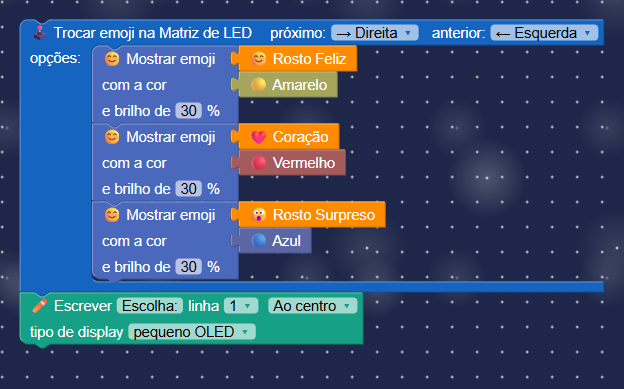</a>
      <strong>11 — Emoji selector</strong> 
      Navigate between options and choose an emoji for the matrix. 
      <a href="11_seletor_de_emojis.xml">Open XML</a>
    </td>
    <td valign="top">
      <a href="12_seletor_de_numeros.xml">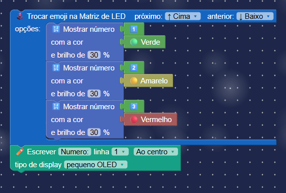</a>
      <strong>12 — Number selector</strong> 
      Use the joystick to browse numbers and display the selected value. 
      <a href="12_seletor_de_numeros.xml">Open XML</a>
    </td>
  </tr>
  <tr>
    <td valign="top">
      <a href="13_luz_e_som_combinados.xml">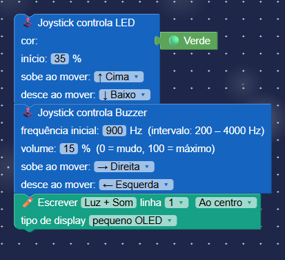</a>
      <strong>13 — Combined light and sound</strong> 
      Combine LED and buzzer control in an interactive experience. 
      <a href="13_luz_e_som_combinados.xml">Open XML</a>
    </td>
    <td valign="top">
      
      <strong>14 — Target game on OLED</strong> 
      Move the player to the target and combine movement, conditions, and scoring. 
      <a href="14_jogo_do_alvo_no_oled.xml">Open XML</a>
    </td>
  </tr>
  <tr>
    <td valign="top">
      <a href="15_estudio_interativo.xml">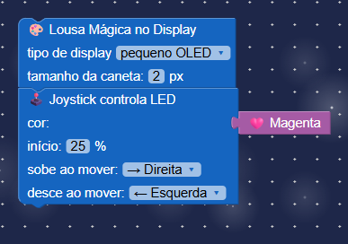</a>
      <strong>15 — Interactive studio</strong> 
      Navigate through a sequence of options and execute only the selected option. 
      <a href="15_estudio_interativo.xml">Open XML</a>
    </td>
    <td valign="top">
      <a href="16_lousa_apagar_com_botao.xml">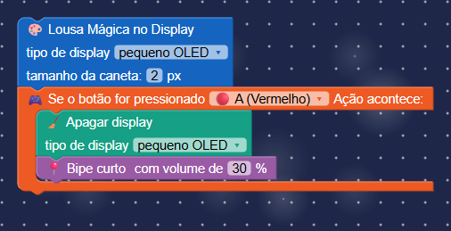</a>
      <strong>16 — Canvas with clear button</strong> 
      Draw on the OLED and press the joystick's center button to clear the screen. 
      <a href="16_lousa_apagar_com_botao.xml">Open XML</a>
    </td>
  </tr>
</table>
