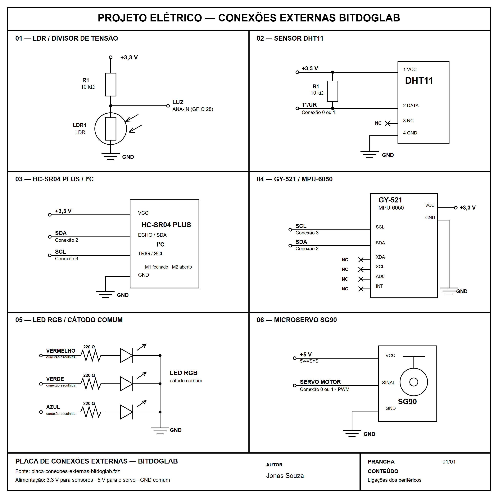

# Placa de Conexões Externas para BitDogLab

Esta pasta reúne o projeto de hardware da **Placa de Conexões Externas**, criada para ser usada com o projeto em blocos **Conexões Externas** do [BIPES BitDogLab Blocos](../../README.md).

A placa aproxima a programação visual do circuito real. Sensores e atuadores ficam organizados em uma única PCB, enquanto contatos grandes permitem fazer as ligações com a BitDogLab usando cabos com garras jacaré. Assim, os mesmos números e nomes escolhidos nos blocos podem ser identificados fisicamente durante a atividade.



A prancha acima reúne, em quadros separados, as ligações do LDR, DHT11, HC-SR04 Plus I²C, MPU-6050, LED RGB e microservo SG90 utilizados no projeto.

## Recursos disponíveis

A placa reúne:

- sensor de temperatura e umidade DHT11;
- sensor de luminosidade LDR;
- sensor ultrassônico HC-SR04 Plus em modo I²C;
- acelerômetro e giroscópio MPU-6050 no módulo GY-521;
- LED RGB de 5 mm com cátodo comum;
- conector para microservo SG90;
- contatos de 3,3 V, 5 V e GND;
- contatos de sinal para SDA, SCL, luz, temperatura/umidade, LED RGB e servo;
- ilhas grandes para conexão por garras jacaré.

O objetivo não é usar obrigatoriamente todos os periféricos ao mesmo tempo. A placa funciona como uma bancada didática: cada exemplo em blocos utiliza apenas os sinais necessários para aquela experiência.

## Arquivos desta pasta

| Arquivo | Conteúdo |
| --- | --- |
| [`placa-conexoes-externas-bitdoglab.fzz`](placa-conexoes-externas-bitdoglab.fzz) | Projeto editável da placa no Fritzing. |
| [`Lista_Componentes_Quantidades_Usadas.xlsx`](Lista_Componentes_Quantidades_Usadas.xlsx) | Lista de materiais, quantidades previstas e referências de compra. |
| [`projeto-eletrico-conexoes-externas.png`](projeto-eletrico-conexoes-externas.png) | Prancha geral com todos os esquemáticos separados em quadros. |
| [`projeto-eletrico-conexoes-externas.svg`](esquematicos/projeto-eletrico-conexoes-externas.svg) | Versão vetorial editável da prancha geral, armazenada com os demais esquemáticos. |
| `README.md` | Guia de hardware, ligações e uso com os blocos. |

Os **arquivos Gerber de fabricação**, incluindo as camadas necessárias para produzir a PCB, também serão disponibilizados neste diretório. Enquanto eles não estiverem publicados, o arquivo Fritzing deve ser tratado como a fonte editável do projeto, não como um pacote final enviado diretamente à fabricante.

## Esquemáticos elétricos

Os esquemáticos foram desenhados em preto e branco e estão disponíveis em PNG para visualização e em SVG para edição vetorial.

| Periférico | PNG | SVG editável |
| --- | --- | --- |
| LDR e divisor de tensão | [`ldr-divisor-tensao.png`](esquematicos/ldr-divisor-tensao.png) | [`ldr-divisor-tensao.svg`](esquematicos/ldr-divisor-tensao.svg) |
| DHT11 e resistor de pull-up | [`dht11.png`](esquematicos/dht11.png) | [`dht11.svg`](esquematicos/dht11.svg) |
| HC-SR04 Plus em I²C | [`hc-sr04-plus-i2c.png`](esquematicos/hc-sr04-plus-i2c.png) | [`hc-sr04-plus-i2c.svg`](esquematicos/hc-sr04-plus-i2c.svg) |
| GY-521 com MPU-6050 | [`mpu6050-gy521.png`](esquematicos/mpu6050-gy521.png) | [`mpu6050-gy521.svg`](esquematicos/mpu6050-gy521.svg) |
| LED RGB de cátodo comum | [`led-rgb-catodo-comum.png`](esquematicos/led-rgb-catodo-comum.png) | [`led-rgb-catodo-comum.svg`](esquematicos/led-rgb-catodo-comum.svg) |
| Microservo SG90 | [`servo-sg90.png`](esquematicos/servo-sg90.png) | [`servo-sg90.svg`](esquematicos/servo-sg90.svg) |

## Hardware utilizado

| Quantidade | Componente |
| ---: | --- |
| 1 | DHT11 para temperatura e umidade |
| 1 | LDR de 5 mm |
| 1 | HC-SR04 Plus com suporte a I²C |
| 1 | Módulo GY-521 com MPU-6050 |
| 1 | Microservo SG90 de 9 g |
| 1 | LED RGB de 5 mm, quatro terminais e cátodo comum |
| 3 | Resistores de 220 Ω, 1/4 W e 5% |
| 2 | Resistores de 10 kΩ, 1/4 W e 5% |
| 1 | Barra de pinos macho, passo de 2,54 mm |
| 1 | Barra de pinos fêmea, passo de 2,54 mm |
| 10 | Cabos com garra jacaré nas duas pontas |

Os três resistores de 220 Ω limitam a corrente dos canais vermelho, verde e azul do LED RGB. Os resistores de 10 kΩ são usados nos circuitos do DHT11 e do LDR.

> **Atenção:** o sensor de distância deve ser o **HC-SR04 Plus compatível com I²C**. O HC-SR04 convencional, limitado aos sinais TRIG e ECHO, não deve ser usado como substituto nesta montagem.

## Contatos da placa

Os contatos grandes aparecem em dois grupos na serigrafia.

### Sensores e alimentação de 3,3 V

| Contato | Função | Ligação na BitDogLab |
| --- | --- | --- |
| `3.3V (+)` | Alimentação dos sensores | Contato `3V3` |
| `SDA` | Dados do barramento I²C | `Conexão 2` |
| `SCL` | Clock do barramento I²C | `Conexão 3` |
| `Luz` | Saída analógica do circuito LDR | `ANA-IN` |
| `T°/UR` | Dados do DHT11 | Conexão escolhida no bloco |
| `GND (-)` | Referência elétrica dos sensores | Contato `GND` |

Na BitDogLab V7, use `Conexão 0` ou `Conexão 1` para o sinal `T°/UR`. Na BitDogLab V6, os blocos permitem as conexões 0, 1, 2 ou 3.

### LED RGB, servo e alimentação de 5 V

| Contato | Função | Ligação na BitDogLab |
| --- | --- | --- |
| `5V (+)` | Alimentação do microservo | Contato `5V-VSYS` |
| `Verde` | Canal verde do LED RGB | Conexão escolhida no bloco |
| `Azul` | Canal azul do LED RGB | Conexão escolhida no bloco |
| `Vermelho` | Canal vermelho do LED RGB | Conexão escolhida no bloco |
| `Servo Motor` | Sinal PWM do SG90 | Conexão escolhida no bloco |
| `GND (-)` | Terra comum do LED e do servo | Contato `GND` |

Cada cor do LED RGB deve usar uma conexão diferente. Na BitDogLab V7, as conexões 2 e 3 também são usadas pelo display e pelo barramento I²C. Quando o display estiver ativo, prefira as conexões 0 e 1 para LED externo, DHT11 ou servo e observe os avisos apresentados pelo editor de blocos.

## Ligações dos periféricos

### DHT11

O DHT11 é alimentado por 3,3 V e utiliza uma única conexão digital para transmitir temperatura e umidade. No editor, os blocos de temperatura e umidade devem apontar para a mesma conexão quando representam o mesmo sensor físico.

Exemplo de ligação:

```text
3V3 da BitDogLab       -> 3.3V da placa externa
Conexão 0              -> T°/UR
GND da BitDogLab       -> GND da placa externa
```

### Sensor de luz LDR

O LDR forma um divisor resistivo na própria PCB. O sinal de luminosidade sai pelo contato `Luz` e deve ser ligado exclusivamente a `ANA-IN`.

```text
3V3 da BitDogLab       -> 3.3V da placa externa
ANA-IN                 -> Luz
GND da BitDogLab       -> GND da placa externa
```

Antes de usar `ANA-IN`, desligue a placa e configure o jumper `JP1` da BitDogLab conforme a orientação exibida pelo editor. Essa alteração deve ser realizada ou supervisionada pelo professor.

### HC-SR04 Plus I²C

O sensor ultrassônico é usado em modo I²C para poder compartilhar o barramento com o display e o MPU-6050.

```text
3V3 da BitDogLab       -> 3.3V da placa externa
Conexão 2 / SDA        -> SDA
Conexão 3 / SCL        -> SCL
GND da BitDogLab       -> GND da placa externa
```

No módulo previsto para este projeto, o professor deve preparar o modo I²C antes da aula, soldando os dois pontos de `M1` e mantendo `M2` aberto. Faça essa preparação com o sensor desconectado e confira se não há ponte de solda em componentes vizinhos.

### MPU-6050 / GY-521

O MPU-6050 usa o mesmo barramento I²C:

```text
VCC do GY-521          -> 3.3V
GND do GY-521          -> GND
SDA do GY-521          -> Conexão 2 / SDA
SCL do GY-521          -> Conexão 3 / SCL
INT, AD0, XCL e XDA    -> sem conexão
```

Os blocos do MPU-6050 externo estão disponíveis para a **BitDogLab V7**. O editor impede o uso desse recurso com o perfil V6 devido às diferenças na organização do barramento I²C.

### LED RGB externo

O LED da PCB é do tipo cátodo comum. Os três canais já possuem resistores de 220 Ω e podem ser ligados às conexões digitais escolhidas nos blocos.

Exemplo sem usar o display:

```text
Conexão 0              -> Vermelho
Conexão 1              -> Verde
Conexão 2              -> Azul
GND da BitDogLab       -> GND da placa externa
```

No programa em blocos, selecione os mesmos números para cada cor. Não atribua duas cores diferentes à mesma conexão.

### Microservo SG90

O SG90 possui três sinais: alimentação positiva, GND e controle PWM.

```text
5V-VSYS da BitDogLab   -> 5V da placa externa
Conexão 0              -> Servo Motor
GND da BitDogLab       -> GND da placa externa
```

Na BitDogLab V7, prefira `Conexão 0` ou `Conexão 1` quando o display estiver sendo usado. Nunca alimente o servo pelo contato de 3,3 V. Se o servo provocar reinicializações ou instabilidade, use uma fonte externa de 5 V adequada e mantenha o GND da fonte em comum com o GND da BitDogLab.

## Como usar com o projeto em blocos

1. Monte os componentes na PCB e revise a polaridade do LED RGB, do DHT11 e dos conectores.
2. Com a BitDogLab desligada e sem o cabo USB, ligue os contatos da placa externa usando as garras jacaré.
3. Abra o BIPES BitDogLab Blocos e selecione a versão correta da placa, preferencialmente a BitDogLab V7.
4. Escolha uma categoria de hardware externo, como **Temperatura e Umidade Externas**, **Sensor de Luz**, **Sensor de Distância**, **Movimento e Inclinação**, **LEDs Externos** ou **Servo Motor**.
5. Nos blocos que apresentam um número de conexão, escolha exatamente a conexão usada pelo cabo físico.
6. Corrija todos os avisos de conflito apresentados no workspace.
7. Peça a um professor para revisar a montagem, conecte o USB e execute o programa.

## Exemplos prontos

| Experiência | Projeto em blocos |
| --- | --- |
| Mostrar a temperatura do DHT11 | [`01_leitura_de_temperatura.xml`](../../examples/dht11/01_leitura_de_temperatura.xml) |
| Mostrar a luminosidade no display | [`01_leitura_no_display.xml`](../../examples/sensor_de_luz/01_leitura_no_display.xml) |
| Usar a luz para controlar o servo | [`06_luz_controla_servo.xml`](../../examples/sensor_de_luz/06_luz_controla_servo.xml) |
| Criar uma régua digital ultrassônica | [`01_regua_digital.xml`](../../examples/sensor_de_distancia/01_regua_digital.xml) |
| Criar uma barreira automática | [`06_barreira_automatica_com_servo.xml`](../../examples/sensor_de_distancia/06_barreira_automatica_com_servo.xml) |
| Mostrar a inclinação do MPU-6050 | [`01_inclinacao_direita_no_display.xml`](../../examples/mpu6050/01_inclinacao_direita_no_display.xml) |
| Testar posições do SG90 | [`01_posicoes_e_angulo_atual.xml`](../../examples/servo_motor/01_posicoes_e_angulo_atual.xml) |
| Acender o canal vermelho externo | [`01_ligar_vermelho.xml`](<../../examples/LEDs externos (KY-016)/01_ligar_vermelho.xml>) |

Os arquivos XML podem ser abertos no editor para estudar, executar e modificar os blocos.

## Segurança e revisão antes de ligar

- Faça ou altere todas as ligações com a BitDogLab desligada e o USB desconectado.
- Nunca deixe garras jacaré vizinhas encostarem entre si.
- Use 3,3 V nos sensores e reserve 5 V para a alimentação do servo.
- Não conecte o sinal `Luz` a uma entrada digital; ele deve ir somente para `ANA-IN`.
- Não troque SDA e SCL: SDA usa a Conexão 2 e SCL usa a Conexão 3.
- Confirme que o HC-SR04 Plus está preparado para I²C; não use o HC-SR04 convencional.
- Revise o jumper `JP1` antes de utilizar o LDR em `ANA-IN`.
- Em atividades educacionais, a montagem, a soldagem e a primeira energização devem ser conferidas pelo professor.

## Fabricação e contribuições

O projeto Fritzing pode ser aberto para estudar o esquemático, a disposição dos componentes e as trilhas da PCB. Ajustes de footprint, revisão elétrica e validação das dimensões devem ser feitos antes de gerar uma nova versão para fabricação.

Quando os Gerbers forem publicados, mantenha junto deles uma identificação de versão compatível com o arquivo `.fzz` e com a lista de componentes. Isso permite reproduzir a placa sem misturar revisões diferentes do circuito.
