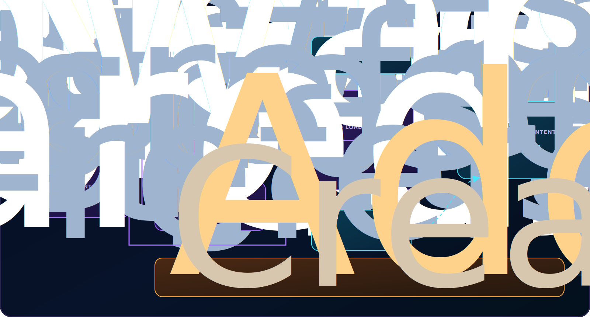

# Guias de hardware

**Português** · [Read in English](README.en.md)

Esta pasta reúne os tutoriais apresentados na aba **Dispositivo**. Cada projeto mantém seu conteúdo, traduções e comportamento em uma pasta independente. Um tutorial não importa nem altera o código de outro tutorial.

## Arquitetura



O fluxo compartilhado é pequeno: `manifest.js` informa quais módulos devem ser carregados, `registry.js` valida e registra esses módulos e `src/js/ui/device-reference.js` monta o menu e apresenta somente o tutorial indicado pela URL.

| Arquivo ou pasta | Responsabilidade |
| --- | --- |
| `manifest.js` | Lista o `tutorial.js` de cada projeto disponível. |
| `registry.js` | Expõe `register`, `get` e `list` e valida o contrato mínimo dos módulos. |
| `<projeto>/tutorial.html` | Guarda o conteúdo em português e as marcações de tradução. |
| `<projeto>/tutorial.js` | Registra menu, template, traduções e comportamento exclusivo do projeto. |
| `<projeto>/tutorial.css` | Opcional; usado somente quando o CSS compartilhado não for suficiente. |
| `src/js/ui/device-reference.js` | Carrega módulos e templates, cria o menu, navega por hash e aplica o idioma. |
| `src/styles/device-reference.css` | Define o visual compartilhado por todos os tutoriais. |
| `src/pages/device-reference.html` | Fornece apenas a estrutura externa: barra lateral e área de conteúdo. |

## Estrutura atual

```text
src/hardware-guides/
├── images/
│   └── architecture.svg
├── bitdoglab/
│   ├── tutorial.html
│   └── tutorial.js
├── estufa/
│   ├── tutorial.html
│   └── tutorial.js
├── robo/
│   ├── tutorial.html
│   └── tutorial.js
├── manifest.js
├── registry.js
├── README.md
└── README.en.md
```

Os módulos `bitdoglab`, `estufa` e `robo` não dependem uns dos outros. Excluir um deles do manifesto não modifica os demais.

## Contrato de um tutorial

Cada `tutorial.js` chama `DeviceHardwareGuides.register` com estas propriedades:

| Propriedade | Obrigatória | Uso |
| --- | --- | --- |
| `id` | Sim | Identificador sem espaços usado no menu e no hash da URL. |
| `order` | Recomendado | Define a posição do tutorial no menu. |
| `template` | Sim | Caminho do `tutorial.html`, relativo a `src/pages/device-reference.html`. |
| `menu` | Sim | Título e descrição do botão em português e inglês. |
| `translations` | Para inglês | Relaciona cada `data-copy` ou `data-copy-alt` ao texto em inglês. |
| `init(context)` | Não | Inicializa interações exclusivas depois que o HTML é inserido. |
| `stylesheet` | Não | Caminho de um CSS exclusivo, carregado apenas enquanto o projeto estiver aberto. |

O objeto `context` recebido por `init` contém:

```js
{
  root: elementoPrincipalDoTutorial,
  lang: 'pt-br' // ou 'en'
}
```

Use sempre `context.root.querySelector(...)` em vez de procurar elementos na página inteira. Isso mantém o comportamento isolado dentro do tutorial.

## Tutorial completo: adicionar um novo guia

O exemplo abaixo cria o projeto fictício `sensor-luz`.

### 1. Criar a pasta

```text
src/hardware-guides/sensor-luz/
├── tutorial.html
└── tutorial.js
```

Use um `id` curto, sem espaços, acentos ou letras maiúsculas. O nome da pasta e o `id` devem ser iguais.

### 2. Escrever o conteúdo em português

Crie `src/hardware-guides/sensor-luz/tutorial.html`:

```html
<section class="project-panel is-active"
         id="sensor-luz"
         data-panel="sensor-luz">
  <header class="article-header">
    <p class="article-index" data-copy="eyebrow">
      PROJETO SENSOR DE LUZ
    </p>
    <h2 data-copy="title">Medindo a luminosidade</h2>
    <p data-copy="intro">
      Este tutorial explica como conectar e testar o sensor de luz.
    </p>
  </header>

  <figure class="component-figure">
    
    <figcaption data-copy="imageCaption">
      Módulo utilizado para medir a luz ambiente.
    </figcaption>
  </figure>

  <div class="prose-block">
    <h3 data-copy="connectionsTitle">Ligações</h3>
    <p data-copy="connectionsText">
      Faça todas as conexões com a BitDogLab desligada.
    </p>
  </div>
</section>
```

Regras importantes:

- O texto original fica em português no HTML. Assim, o tutorial continua legível mesmo sem JavaScript.
- Use `data-copy="chave"` em textos que precisam de tradução.
- Use `data-copy-alt="chave"` em imagens traduzíveis.
- As chaves devem ser únicas e existir em `translations.en`.
- A tradução substitui `textContent`. Coloque `data-copy` diretamente no elemento textual, evitando envolver estruturas internas que precisem ser preservadas.
- As imagens pertencem a `src/assets/images/devices/`. Como o fragmento é exibido por `src/pages/device-reference.html`, o caminho começa com `../assets/`, mesmo que o HTML esteja fisicamente dentro de `hardware-guides`.

### 3. Registrar o módulo e suas traduções

Crie `src/hardware-guides/sensor-luz/tutorial.js`:

```js
(function (registry) {
  'use strict';

  registry.register({
    id: 'sensor-luz',
    order: 4,
    template: '../hardware-guides/sensor-luz/tutorial.html',

    menu: {
      'pt-br': {
        title: 'Sensor de luz',
        description: 'Luminosidade ambiente'
      },
      en: {
        title: 'Light sensor',
        description: 'Ambient light'
      }
    },

    translations: {
      en: {
        eyebrow: 'LIGHT SENSOR PROJECT',
        title: 'Measuring light levels',
        intro: 'This tutorial explains how to connect and test the light sensor.',
        imageAlt: 'Light sensor used in the project',
        imageCaption: 'Module used to measure ambient light.',
        connectionsTitle: 'Connections',
        connectionsText: 'Make every connection with BitDogLab powered off.'
      }
    }
  });
})(window.DeviceHardwareGuides);
```

O menu é criado automaticamente a partir de `order` e `menu`. Não adicione botões manualmente em `device-reference.html`.

### 4. Adicionar o módulo ao manifesto

Abra `manifest.js` e acrescente uma linha:

```js
window.DeviceHardwareGuideScripts = [
  '../hardware-guides/bitdoglab/tutorial.js',
  '../hardware-guides/estufa/tutorial.js',
  '../hardware-guides/robo/tutorial.js',
  '../hardware-guides/sensor-luz/tutorial.js'
];
```

Esse é o único arquivo compartilhado que precisa ser alterado para um novo guia aparecer na aba **Dispositivo**.

### 5. Adicionar comportamento exclusivo, se necessário

Tutoriais somente de texto, imagens e tabelas não precisam de `init`. Para um botão ou componente interativo, acrescente a função ao objeto registrado:

```js
init: function (context) {
  var button = context.root.querySelector('#testLightSensor');
  var result = context.root.querySelector('#lightSensorResult');
  if (!button || !result) return;

  button.addEventListener('click', function () {
    result.textContent = context.lang === 'en'
      ? 'Connection reviewed.'
      : 'Ligação conferida.';
  });
}
```

Não coloque esse comportamento no carregador compartilhado. Ele pertence ao `tutorial.js` do projeto.

### 6. Adicionar CSS exclusivo somente quando necessário

Primeiro tente reutilizar as classes de `src/styles/device-reference.css`, como:

- `article-header`
- `prose-block`
- `recommendation-block`
- `table-wrap`
- `tutorial-figure`
- `photo-pair`
- `procedure-block`

Se o projeto realmente precisar de um componente visual novo, crie `sensor-luz/tutorial.css` e declare:

```js
stylesheet: '../hardware-guides/sensor-luz/tutorial.css'
```

O carregador adiciona esse CSS ao abrir o tutorial e o remove ao trocar de projeto. Nunca coloque estilos de um único projeto no CSS compartilhado.

### 7. Testar as duas versões

Com a plataforma servida localmente por HTTP, abra:

```text
src/pages/device-reference.html#sensor-luz
src/pages/device-reference.html?lang=en#sensor-luz
```

Confira:

- o novo botão e sua posição no menu;
- título, descrição e conteúdo em português;
- todas as traduções em inglês;
- imagens sem erro 404;
- tabelas e layout em telas largas e estreitas;
- atualização do hash ao trocar de tutorial;
- comportamento exclusivo, se houver;
- retorno aos outros tutoriais sem estilos ou eventos residuais.

## Guia de hardware versus projeto Blockly

Adicionar a pasta e a entrada no manifesto cria um **guia na aba Dispositivo**. Isso não cria automaticamente uma categoria de blocos.

Se o novo hardware também for um modo selecionável em **Projetos**, será necessário cadastrar separadamente:

1. o cartão do projeto em `src/pages/index.html`;
2. suas categorias com `data-project` em `src/js/config/toolbox.xml`;
3. seu nome em `WorkspaceManager.PROJECT_NAMES`;
4. opcionalmente, um aviso em `WorkspaceManager.PROJECT_HARDWARE_GUIDES` apontando para `device-reference.html#sensor-luz`.

Essa separação é intencional: um guia de montagem pode existir sem adicionar novos blocos, e uma categoria Blockly pode reutilizar hardware já documentado.
