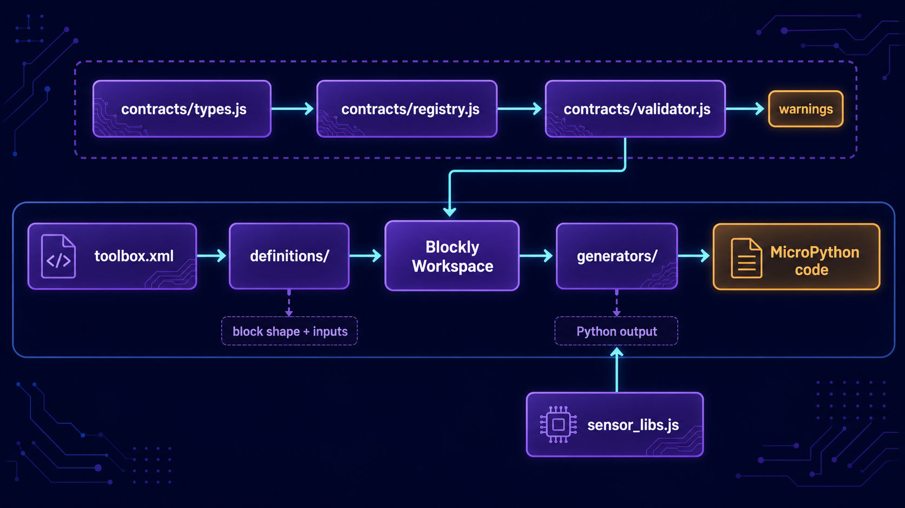

# Sistema de blocos da BitDogLab

**Português** · [Read in English](README.en.md)

Esta pasta implementa os blocos visuais usados no BIPES e a transformação de cada bloco em Python para MicroPython. Ela também define contratos semânticos que impedem combinações incompatíveis e apresentam avisos antes da geração ou execução do programa.

## Arquitetura



A toolbox escolhe quais blocos aparecem para o usuário. As definições controlam forma e conexões, os contratos validam o workspace e os geradores produzem o código executado na BitDogLab.

| Caminho | Responsabilidade |
| --- | --- |
| `definitions/` | Registra aparência, campos, entradas, saídas e conexões dos blocos Blockly. |
| `generators/` | Converte cada tipo de bloco em imports, configuração e instruções Python. |
| `contracts/types.js` | Declara domínios semânticos e compatibilidade entre conexões. |
| `contracts/registry.js` | Associa tipos de bloco a requisitos, dependências e mensagens bilíngues. |
| `contracts/validator.js` | Analisa o workspace, aplica avisos e bloqueia código inválido. |
| `sensor_libs.js` | Mantém drivers MicroPython incorporados para displays e sensores. |

## Como um bloco é registrado

Uma definição e seu gerador compartilham o mesmo identificador:

```js
Blockly.Blocks['meu_bloco'] = {
  init: function() {
    // Forma e conexões do bloco.
  }
};

Blockly.Python['meu_bloco'] = function(block) {
  return 'print("BitDogLab")\n';
};
```

Para aparecer na interface, o identificador também deve ser incluído em `src/js/config/toolbox.xml`. Se houver restrições de uso, adicione o domínio em `contracts/types.js` e o contrato em `contracts/registry.js`.

## Fluxo básico

1. `toolbox.xml` oferece as categorias e blocos disponíveis.
2. `definitions/` cria os blocos dentro do workspace Blockly.
3. `contracts/` verifica tipos, entradas obrigatórias, ancestrais e dependências.
4. `generators/` transforma os blocos válidos em Python.
5. `sensor_libs.js` fornece drivers incorporados quando um gerador precisa deles.
6. O núcleo organiza o Python final e o envia para a placa.

> A ordem dos scripts em `src/pages/index.html` é importante: tipos vêm antes das definições, contratos antes da validação e definições antes dos geradores correspondentes.
