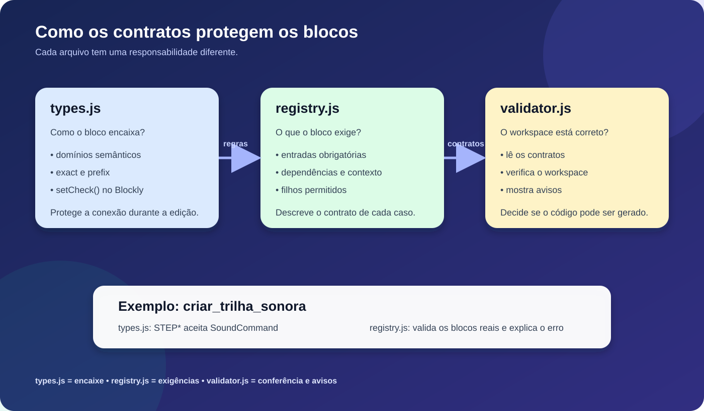

# Blockly block contracts

**English** · [Leia em português](README.md)

This folder contains the rules that make Blockly blocks connect safely and warn when a program is incomplete or used in the wrong context.



## The difference between the three files

| File | Question it answers | Responsibility |
| --- | --- | --- |
| `types.js` | “What can connect here?” | Defines semantic connection types and applies `setCheck()` in Blockly. |
| `registry.js` | “What does this block require?” | Registers required inputs, dependencies, allowed blocks, and warning text. |
| `validator.js` | “Is the program valid?” | Reads the rules, checks the workspace, and shows warnings or blocks invalid generation. |

## Why does `types.js` not list every block?

`types.js` works with behavior groups called domains. For example, several blocks can belong to `LED_COMMANDS` or `SOUND_COMMANDS`, so one rule can be applied to the whole group.

Regular blocks also receive the default `ProgramCommand` rule through `applyDefaultPreviousCheck()`. They do not need to be listed one by one.

The file explicitly declares only special connection cases, such as LED commands, sound commands, matrix commands, joystick options, and dynamic inputs like `STEP0`, `STEP1`, and `DESENHO0`.

## Why does `registry.js` have more rules?

The registry does more than control visual connections. It describes block-specific requirements, such as required values, dependencies, allowed children inside containers, dynamic input prefixes, and warning messages.

That is why `registry.js` looks more detailed. `types.js` reuses domains and general rules, while the registry records validation contracts. Blocks without special requirements do not need their own entry in `CONTRACTS`.

## Real example: `criar_trilha_sonora`

The block has command inputs named `STEP0`, `STEP1`, `STEP2`, and so on.

In `types.js`, the `STEP` prefix assigns the semantic `SoundCommand` connection type. This controls what Blockly allows to connect.

In `registry.js`, the same prefix points to the concrete `SOUND_COMMANDS` block IDs and defines the human-readable label used by validation warnings.

Both rules matter: Blockly protects editing-time connections, while the validator can also detect invalid XML or programmatically-created workspace states.

## Shared APIs

| API | Created by | Used for |
| --- | --- | --- |
| `Code.BlockTypeDomains` | `types.js` | Querying domains, output types, and connection rules. |
| `Code.BlockContracts` | `registry.js` | Querying each block contract and its messages. |

## Mental model

```text
types.js     = how the block connects
registry.js  = what the block requires
validator.js = how the system checks and warns
```
