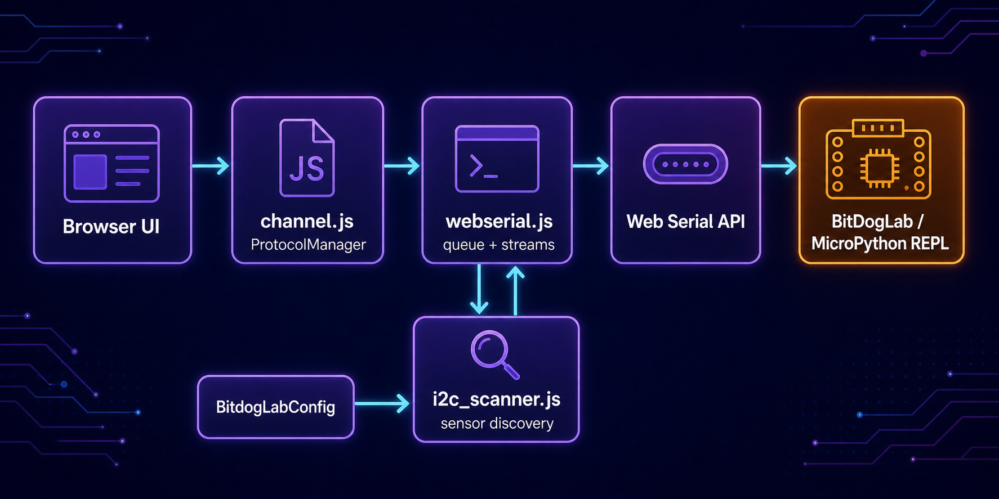

# Camada de comunicação da BitDogLab

**Português** · [Read in English](README.en.md)

Esta pasta conecta a interface do BIPES à placa pelo navegador. Ela organiza a fila de comandos, controla a sessão Web Serial, acompanha o prompt do MicroPython e detecta sensores I²C sem misturar essas responsabilidades com a interface.

## Arquitetura



`ProtocolManager` é a entrada usada pelo restante da aplicação. Ele encaminha as operações para a implementação Web Serial, enquanto o scanner I²C reutiliza a mesma conexão quando a placa está ociosa.

| Arquivo | Responsabilidade |
| --- | --- |
| `channel.js` | Define constantes do protocolo, controla a fila de transmissão e oferece a fachada `ProtocolManager` (`mux`). |
| `webserial.js` | Abre a porta, lê e escreve streams, consome a fila e recupera o prompt do REPL. |
| `i2c_scanner.js` | Examina os barramentos I²C, compara dispositivos detectados e avisa sobre conexões ou remoções de sensores conhecidos. |

## Como é iniciado

Os scripts são carregados por `src/pages/index.html`. Depois de `Code.init()`, a página cria o canal Web Serial e o multiplexador compatível com o restante do projeto:

```js
var Channel = {};
Channel['webserial'] = new webserial();
Channel['mux'] = new mux();
```

Os nomes `webserial` e `mux` são aliases de compatibilidade para `WebSerialProtocol` e `ProtocolManager`. O scanner I²C mantém uma instância global própria:

```js
const i2cScanner = new I2CScanner();
```

## Fluxo básico

1. A interface solicita uma conexão por `ProtocolManager`.
2. `webserial.js` pede uma porta à Web Serial API e abre os streams.
3. `channel.js` divide o código em pacotes e o adiciona à fila.
4. `webserial.js` envia os pacotes e reconhece o prompt `>>>` do MicroPython.
5. Quando o código do usuário não está em execução, `i2c_scanner.js` consulta os barramentos configurados.

> A Web Serial API depende de um navegador compatível e de uma página em contexto seguro. Durante a execução do código do usuário, o scanner I²C é pausado para não interromper o REPL.
