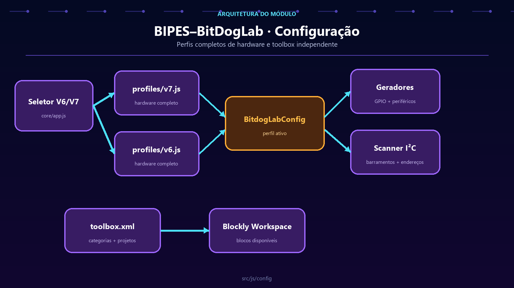

# BitDogLab configuration

[Leia em português](README.md) · **English**

This folder centralizes hardware differences between BitDogLab revisions and defines the main Blockly toolbox. Generators read the active profile instead of scattering GPIO numbers and code assembly rules throughout the project.

## Architecture



Revision V7 is loaded as the default configuration. The interface selector can replace the active object with V6 while preserving the structure expected by generators, the I²C scanner, and the core.

| File | Responsibility |
| --- | --- |
| `profiles/base.js` | Contains only shared generation, copy, and validation rules. It declares no GPIOs. |
| `profiles/v7.js` | Fully declares V7 pins and peripherals and creates `BitdogLabConfig`. |
| `profiles/v6.js` | Fully declares V6 pins and peripherals and creates `BitdogLabConfig_V6`. |
| `toolbox.xml` | Organizes the categories, blocks, shadows, and initial values displayed by Blockly. |

## Active profile

The bootstrap preserves the V7 profile and changes the global reference when users select another revision:

```js
var BitdogLabConfig_V7 = BitdogLabConfig;

BitdogLabConfig = (version === 'v6')
  ? BitdogLabConfig_V6
  : BitdogLabConfig_V7;
```

Both profiles expose equivalent sections such as `PINS`, `NEOPIXEL`, `JOYSTICK`, `DISPLAY`, `ROBOT`, `SENSOR`, `MARKERS`, and `SETUP_PATTERNS`. Each version file intentionally repeats every hardware value, including equal values, so it remains a complete and easy-to-read board reference.

## Basic flow

1. `src/pages/index.html` loads the base, V7, and V6 profiles.
2. `app.js` keeps `BitdogLabConfig` pointing to the selected revision.
3. Block generators read pins, peripherals, and rules from the active profile.
4. `core/codegen/` uses markers and patterns to organize setup and loop code.
5. The I²C scanner uses the buses and known devices from the same profile.
6. In parallel, `toolbox.xml` is loaded, filtered by project, and applied to the workspace.

> A new revision should fully declare its hardware and preserve the same structural contract, avoiding implicit inheritance and board-specific conditionals in consumers.
