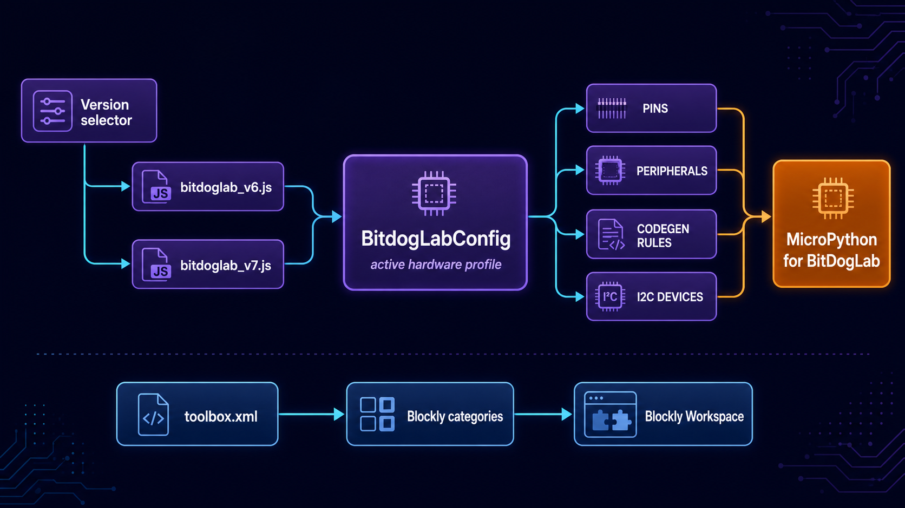

# Configuração da BitDogLab

**Português** · [Read in English](README.en.md)

Esta pasta centraliza as diferenças de hardware entre revisões da BitDogLab e define a toolbox principal do Blockly. Os geradores consultam o perfil ativo em vez de espalhar números de GPIO e regras de montagem de código pelo projeto.

## Arquitetura



A revisão V7 é carregada como configuração padrão. O seletor da interface pode trocar o objeto ativo por V6, mantendo a mesma estrutura esperada pelos geradores, pelo scanner I²C e pelo núcleo.

| Arquivo | Responsabilidade |
| --- | --- |
| `bitdoglab_v7.js` | Declara `BitdogLabConfig`, perfil padrão com pinos e periféricos da V7. |
| `bitdoglab_v6.js` | Declara `BitdogLabConfig_V6` com as diferenças de pinos, brilho e barramentos da V6. |
| `toolbox.xml` | Organiza categorias, blocos, sombras e valores iniciais exibidos no Blockly. |

## Perfil ativo

O bootstrap preserva o perfil V7 e troca a referência global quando o usuário muda a revisão:

```js
var BitdogLabConfig_V7 = BitdogLabConfig;

BitdogLabConfig = (version === 'v6')
  ? BitdogLabConfig_V6
  : BitdogLabConfig_V7;
```

Os dois perfis expõem seções equivalentes, como `PINS`, `NEOPIXEL`, `JOYSTICK`, `DISPLAY`, `ROBOT`, `SENSOR`, `MARKERS` e `SETUP_PATTERNS`.

## Fluxo básico

1. `src/pages/index.html` carrega os perfis V7 e V6.
2. `app.js` mantém `BitdogLabConfig` apontando para a revisão escolhida.
3. Geradores de blocos consultam pinos, periféricos e regras do perfil ativo.
4. `codegen.js` usa marcadores e padrões para organizar configuração e loop.
5. O scanner I²C usa os barramentos e dispositivos conhecidos do mesmo perfil.
6. Em paralelo, `toolbox.xml` é carregado, filtrado pelo projeto e aplicado ao workspace.

> Uma nova revisão deve preservar o mesmo contrato estrutural das configurações existentes; assim, consumidores não precisam de condicionais específicas para cada placa.
