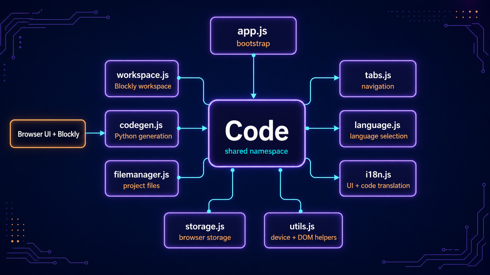

# Núcleo da aplicação BIPES

**Português** · [Read in English](README.en.md)

Esta pasta reúne a coordenação principal da aplicação no navegador. Seus módulos compartilham o namespace global `Code` para inicializar a interface, administrar o workspace Blockly, gerar Python, navegar entre painéis, persistir projetos e aplicar o idioma escolhido.

## Arquitetura



Cada arquivo concentra uma responsabilidade e publica apenas os pontos necessários em `Code` ou, no caso do armazenamento e das utilidades, em APIs globais específicas.

| Arquivo | Responsabilidade |
| --- | --- |
| `app.js` | Executa o bootstrap e coordena a inicialização dos subsistemas. |
| `workspace.js` | Cria o Blockly, carrega a toolbox, filtra projetos e apresenta lembretes de uso. |
| `codegen.js` | Valida geradores, organiza o Python produzido e mantém a geração automática. |
| `tabs.js` | Alterna, divide, renderiza e redimensiona os painéis da aplicação. |
| `filemanager.js` | Prepara o painel de arquivos e serializa o workspace como XML. |
| `language.js` | Escolhe o idioma, carrega traduções e configura a direção da página. |
| `i18n.js` | Traduz a interface, a toolbox e identificadores do código gerado, além de auditar o resultado. |
| `storage.js` | Salva projetos e backups do workspace no navegador e restaura a última sessão. |
| `utils.js` | Fornece operações de execução, arquivos da placa, terminal, DOM e animações. |

## Como é iniciado

Os módulos usam o mesmo objeto global sem substituir extensões já registradas:

```js
var Code = window.Code || (window.Code = {});
```

Depois que os scripts são carregados, `src/pages/index.html` inicia o núcleo com uma única chamada:

```js
Code.init();
```

`app.js` então prepara mensagens, workspace, idioma, abas e gerenciador de arquivos. A ordem de carregamento declarada na página é importante porque o bootstrap chama funções publicadas pelos módulos anteriores.

## Fluxo básico

1. `app.js` inicia os serviços disponíveis no namespace `Code`.
2. `workspace.js` cria o Blockly e carrega as categorias de blocos.
3. Alterações no workspace são persistidas por `storage.js`.
4. `codegen.js` transforma os blocos em Python e aplica os ajustes de execução.
5. `tabs.js` apresenta Blockly, console, arquivos, referência da placa ou painel de dados.
6. `language.js` e `i18n.js` mantêm interface, toolbox e código gerado no idioma selecionado.

> Este código usa scripts clássicos e globais compartilhados. Ao adicionar um módulo, preserve o namespace `Code` e confira sua posição em `src/pages/index.html`.
