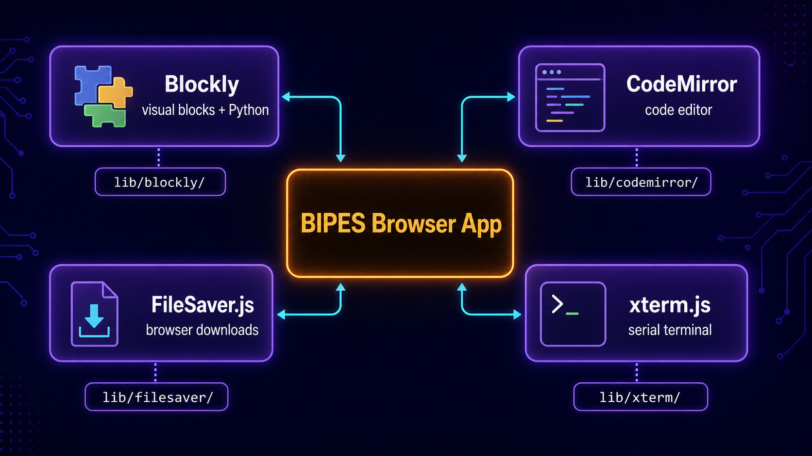

# Bibliotecas do navegador

**Português** · [Read in English](README.en.md)

Esta pasta mantém cópias locais das bibliotecas de terceiros necessárias para executar o BIPES diretamente no navegador. Elas fornecem o editor visual, geração Python, editor de texto, downloads e terminal sem depender de um gerenciador de pacotes em tempo de execução.

## Arquitetura



As bibliotecas são independentes entre si e expõem APIs globais consumidas pela aplicação. `src/pages/index.html` controla a ordem em que os arquivos JavaScript e CSS são carregados.

| Caminho | Responsabilidade |
| --- | --- |
| `blockly/blockly_compressed.js` | Fornece workspace, blocos, conexões, toolbox e serialização XML. |
| `blockly/python_compressed.js` | Adiciona o gerador Python base usado pelos módulos da BitDogLab. |
| `codemirror/` | Fornece o editor de código, seu CSS e o modo de sintaxe Python. |
| `filesaver/FileSaver.js` | Disponibiliza downloads de arquivos criados no navegador. |
| `xterm/xterm.js` | Renderiza o terminal usado para entrada e saída da conexão serial. |

## Como é carregado

As bibliotecas são incluídas como scripts clássicos e disponibilizam objetos globais:

```html
<script src="../js/lib/blockly/blockly_compressed.js"></script>
<script src="../js/lib/blockly/python_compressed.js"></script>
<script src="../js/lib/filesaver/FileSaver.js"></script>
<script src="../js/lib/xterm/xterm.js"></script>
<script src="../js/lib/codemirror/codemirror.js"></script>
```

O modo Python do CodeMirror é carregado depois do núcleo do editor, e `codemirror.css` é incluído no cabeçalho da página.

## Fluxo básico

1. Blockly cria o ambiente visual e oferece a infraestrutura de geração Python.
2. Os módulos em `src/js/blocks/` registram blocos e geradores específicos.
3. CodeMirror apresenta arquivos e código em um editor com realce de sintaxe.
4. xterm.js mostra o terminal conectado ao fluxo Web Serial.
5. FileSaver.js permite baixar conteúdos produzidos pela aplicação.

> Estes arquivos são builds vendorizados, muitos deles comprimidos. Prefira atualizar a biblioteca a partir de sua distribuição oficial em vez de editar manualmente o arquivo gerado.
