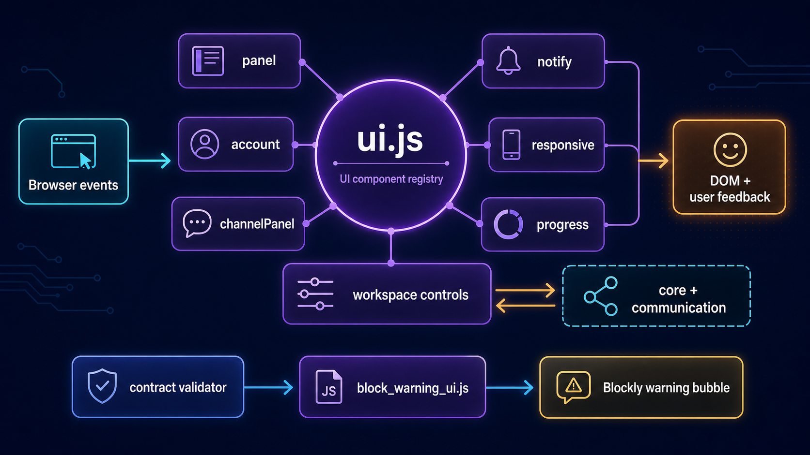

# Interface do BIPES

**Português** · [Read in English](README.en.md)

Esta pasta conecta eventos do navegador aos serviços do BIPES e mantém o estado visual da aplicação. Ela controla painéis, projetos, notificações, responsividade, progresso, ações do workspace e a apresentação dos avisos de contratos Blockly.

## Arquitetura



`ui.js` reúne os componentes clássicos registrados no objeto global `UI`. `block_warning_ui.js` é uma camada menor e especializada que adapta somente as bolhas geradas pelo validador de blocos.

| Componente | Responsabilidade |
| --- | --- |
| `panel` | Abre e fecha painéis laterais compartilhados. |
| `account` | Cria, importa, lista, abre e remove projetos locais. |
| `channelPanel` | Apresenta e seleciona o canal de comunicação serial. |
| `notify` | Exibe mensagens traduzidas e mantém o histórico de logs. |
| `responsive` | Ajusta o layout e fecha painéis em áreas externas. |
| `progress` | Mostra progresso de transmissão e operações de arquivo. |
| `workspace` | Liga botões a execução, conexão, dispositivo e arquivos XML. |
| `block_warning_ui.js` | Quebra textos longos e estiliza bolhas de avisos de contratos. |

## Como é iniciado

Depois que núcleo, comunicação, terminal e arquivos estão disponíveis, `src/pages/index.html` cria o registro global:

```js
var UI = {};
UI['responsive'] = new responsive();
UI['notify'] = new notify();
UI['progress'] = new progress();
UI['account'] = new account('#accountButton', '.account-panel');
UI['workspace'] = new workspace();
```

Outros módulos acessam esses componentes por chave, por exemplo `UI['notify'].send(message)` e `UI['progress'].start(total)`.

## Fluxo básico

1. Cliques e mudanças de seleção chegam aos componentes de `ui.js`.
2. O componente atualiza o DOM e, quando necessário, chama núcleo, armazenamento ou comunicação.
3. `notify` traduz e apresenta respostas ao usuário.
4. `progress` acompanha filas e transferências.
5. O validador de contratos escreve avisos nos blocos.
6. `block_warning_ui.js` formata a bolha de aviso para leitura no workspace.

> A camada depende de vários globais legados, como `Code`, `Channel`, `Files`, `Tool` e `mux`. Preserve a ordem de carregamento ao dividir ou adicionar componentes.
