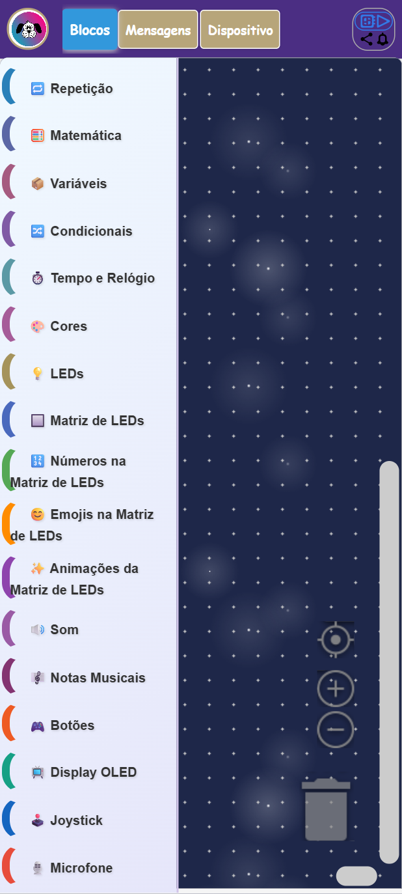
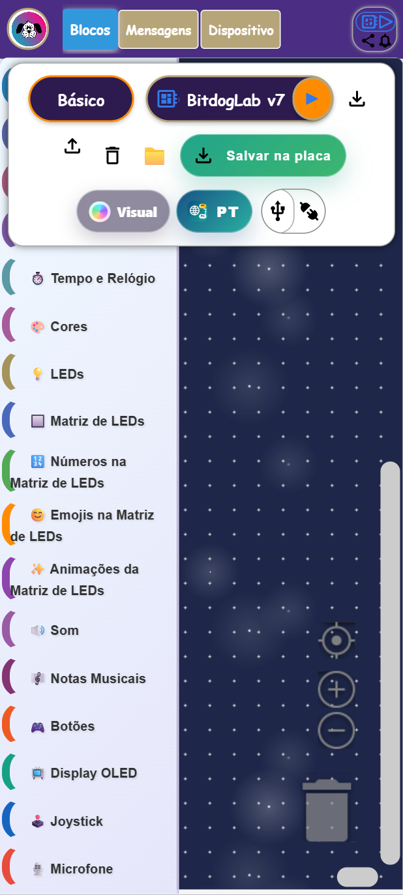
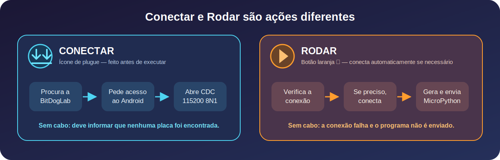
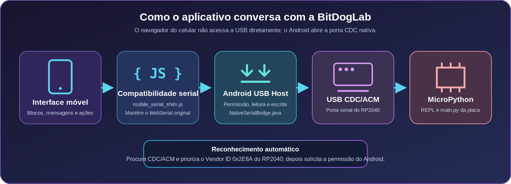

<div align="center">
  

  # BIPES BitDogLab para Android

  **A mesma plataforma visual do computador, empacotada como aplicativo Android com comunicação USB CDC nativa.**

  
  
  
  
</div>

## Visão geral

O aplicativo permite montar programas com blocos no celular e comunicá-los com
a BitDogLab por um cabo USB de dados e um adaptador OTG. Ele reaproveita os
mesmos blocos, geradores MicroPython, projetos, temas, mensagens, tutoriais de
hardware, terminal, arquivos e scanner I2C da plataforma usada no computador.

O site continua usando **Web Serial**. O aplicativo não usa WebUSB: ele acessa
a porta serial CDC/ACM do RP2040 pela API **USB Host nativa do Android**. Por
isso não é necessário instalar `webusb.py`, modificar `boot.py` ou preparar um
firmware especial na placa.

```text
Computador: navegador -> Web Serial -> USB CDC -> MicroPython
Android:    WebView -> ponte Android USB Host -> USB CDC -> MicroPython
```

## Interface no celular

As imagens abaixo foram capturadas da aplicação real em uma tela de 412 × 915
pixels. O layout móvel é acrescentado somente no APK e não altera o site.

<table>
  <tr>
    <td align="center"><strong>Área de blocos</strong></td>
    <td align="center"><strong>Painel de ferramentas</strong></td>
  </tr>
  <tr>
    <td></td>
    <td></td>
  </tr>
</table>

### Controles principais

| Controle | Função |
| --- | --- |
| **Blocos** | Abre a paleta e a área onde o programa é montado. |
| **Mensagens** | Mostra o terminal e a resposta recebida do MicroPython. |
| **Dispositivo** | Abre a referência da BitDogLab e os tutoriais de hardware. |
| **Ferramentas**, no canto superior direito | Abre e fecha o painel mostrado na segunda imagem. |
| **Básico / Robô / Estufa / Musical** | Seleciona o projeto e filtra as categorias disponíveis. |
| **BitDogLab v7 / v6** | Seleciona a configuração física e os blocos da versão da placa. |
| **Plugue** | Conecta ou desconecta manualmente a BitDogLab. |
| **USB** | Seleciona o canal serial; atualmente existe apenas o canal serial. |
| **▶ Rodar** | Gera o MicroPython e envia o programa. Se necessário, tenta conectar primeiro. |
| **Salvar na placa** | Grava o programa como `main.py`; também tenta conectar automaticamente. |
| **Mensagens → Parar programa** | Envia a interrupção para o MicroPython. |
| **Visual e PT/EN** | Alteram o tema e o idioma da interface. |

## Hardware necessário

- Celular ou tablet com Android 8.0 ou mais recente.
- Suporte a USB Host/OTG no aparelho Android.
- Adaptador OTG compatível com a conexão do celular.
- Cabo USB **de dados**; um cabo somente de energia não funciona.
- BitDogLab com o MicroPython padrão já usado no computador.

A ligação física é:

```text
Celular Android -> adaptador OTG -> cabo USB de dados -> BitDogLab
```

A bateria presente na BitDogLab não substitui o cabo de dados. Ela pode
alimentar a placa, mas o Android precisa da conexão USB para enviar e receber
informações.

## Conectar e Rodar



### Conexão manual

O botão de plugue procura uma porta serial USB. Quando encontra a BitDogLab, o
Android mostra sua própria janela solicitando autorização. Depois da
autorização, o aplicativo abre a porta e mantém a conexão disponível para
rodar, parar, salvar, usar o terminal, gerenciar arquivos e executar o scanner
I2C.

### Conexão automática ao rodar

Não é obrigatório tocar primeiro no plugue. Ao pressionar **▶ Rodar**, a
plataforma verifica se já existe uma conexão:

1. Se estiver conectada, gera e envia o programa imediatamente.
2. Se estiver desconectada, inicia a procura da BitDogLab.
3. O Android solicita a permissão USB quando necessário.
4. A plataforma aguarda até dois segundos e executa somente se a conexão tiver
   sido estabelecida.

O botão **Salvar na placa** usa a mesma tentativa automática antes de gravar o
`main.py`.

> **Sem cabo ou sem placa:** o aplicativo não tem para onde enviar o programa.
> O botão Rodar tenta conectar, mas não haverá execução nem resposta em
> Mensagens. Nesta versão, a falha de seleção pode ficar somente no log interno
> e parecer que nada aconteceu.

## Como a BitDogLab é reconhecida

O Android não trabalha com nomes como `COM3` ou `COM4`. O reconhecimento usa os
descritores do dispositivo USB:

1. O Android detecta o equipamento conectado ao adaptador OTG.
2. O aplicativo enumera os dispositivos com porta serial **CDC/ACM**.
3. Entre os dispositivos compatíveis, dá preferência ao **Vendor ID `0x2E8A`**
   (`11914` em decimal), utilizado pelo RP2040/Raspberry Pi.
4. O sistema Android pede ao usuário a permissão de acesso ao dispositivo.
5. A primeira porta serial do dispositivo é aberta em **115200 baud, 8 bits,
   sem paridade e 1 stop bit — 8N1**.

Se não houver um dispositivo com o Vendor ID do RP2040, a implementação aceita
a primeira porta CDC compatível encontrada. Portanto, durante a aula é melhor
deixar conectado somente o adaptador da BitDogLab, sem outros conversores USB
serial no mesmo hub.

O filtro Android que permite reconhecer a conexão física está em
[`device_filter.xml`](android/app/src/main/res/xml/device_filter.xml), e a
seleção completa ocorre em
[`NativeSerialBridge.java`](android/app/src/main/java/org/bitdoglab/bipes/NativeSerialBridge.java).

## Arquitetura da comunicação



### Responsabilidade de cada camada

| Camada | Responsabilidade |
| --- | --- |
| Interface compartilhada | Blocos, geração de código, terminal, projetos, arquivos e scanner I2C. |
| `mobile_serial_shim.js` | Apresenta a conexão Android no formato de porta esperado pelo `webserial.js`. |
| `NativeSerialBridge.java` | Enumera USB, solicita permissão, abre CDC, lê, escreve e trata retirada do cabo. |
| Android USB Host | Fornece acesso ao dispositivo conectado por OTG, sem root. |
| CDC/ACM do RP2040 | Transporta os bytes da porta serial padrão da placa. |
| MicroPython | Executa o código, responde pelo REPL e carrega `main.py`. |

O arquivo Web Serial do site é empacotado no APK sem alterações. A
compatibilidade móvel é injetada antes de a interface iniciar, oferecendo:

```javascript
port.open({ baudRate: 115200 })
port.readable
port.writable
port.close()
```

Assim, o protocolo já usado no computador continua responsável por dividir os
dados em pacotes, reconhecer o prompt `>>>`, executar callbacks e controlar a
fila de transmissão.

## O que acontece em cada operação

### Rodar

1. Os blocos são convertidos para o mesmo MicroPython gerado no computador.
2. A conexão é aberta automaticamente se necessário.
3. O código é colocado na fila serial e enviado em ordem.
4. O aplicativo acompanha a resposta até o prompt `>>>` do REPL.
5. A saída recebida aparece em **Mensagens**.

### Parar

O fluxo serial envia `Ctrl+C` ao REPL para interromper o programa. O botão
laranja volta ao estado de execução quando a placa responde novamente.

### Salvar na placa

O código é gravado como `main.py` usando o protocolo já existente. A rotina
envia o conteúdo, conclui o arquivo e verifica a quantidade de bytes gravados.
Na próxima inicialização, o MicroPython poderá executar esse arquivo.

### Terminal, arquivos e scanner I2C

Todas essas funções usam a mesma porta CDC já autorizada. Não são abertas
conexões USB separadas para cada ferramenta.

## Instalação do APK de desenvolvimento

O APK local fica em:

```text
src/mobile/android/app/build/outputs/apk/debug/app-debug.apk
```

Ele pode ser transferido para o celular e aberto pelo gerenciador de arquivos.
Como esse APK é instalado fora da Play Store e usa uma assinatura de
desenvolvimento, o Play Protect pode mostrar uma tela de verificação e a opção
**Instalar assim mesmo**. Esse aviso ocorre antes de o aplicativo executar e
não indica uma falha na comunicação USB.

Também é possível instalar por ADB:

```powershell
adb install -r .\src\mobile\android\app\build\outputs\apk\debug\app-debug.apk
```

Para distribuição pública sem o fluxo de desenvolvimento, será necessário
gerar uma versão release com uma chave definitiva e registrar/publicar o
pacote `org.bitdoglab.bipes` pelo canal de distribuição escolhido. A chave de
assinatura nunca deve ser salva no repositório.

## Compilar o aplicativo

### Requisitos de desenvolvimento

- JDK 17.
- Android SDK com a plataforma Android 36 instalada.
- Variável `ANDROID_HOME` configurada ou `android/local.properties` local.
- Node.js para executar os testes JavaScript.

### Build de desenvolvimento

Na raiz do repositório:

```powershell
cd src/mobile/android
.\gradlew.bat clean lintDebug assembleDebug
```

Durante o build, a tarefa `prepareWebAssets` lê `src/` e
`device-file-manager/` e cria uma cópia temporária em
`android/app/build/generated/webAssets/`. Essa pasta é ignorada pelo Git e é
removida por `gradlew clean`.

Não existe uma segunda interface mantida dentro do aplicativo: alterações
futuras nos blocos ou geradores entram no próximo APK quando ele for
recompilado.

## Estrutura do código móvel

```text
src/mobile/
├── README.md
├── docs/images/                         # capturas e diagramas deste guia
├── scripts/check-web-boundary.mjs       # protege os arquivos web estáveis
├── tests/mobile-serial-shim.test.js     # contrato e integração serial
├── web-boundary.json                    # hashes da fronteira web
└── android/
    └── app/src/main/
        ├── AndroidManifest.xml
        ├── java/org/bitdoglab/bipes/
        │   ├── MainActivity.java
        │   └── NativeSerialBridge.java
        └── res/
            ├── raw/mobile_layout.css
            ├── raw/mobile_serial_shim.js
            └── xml/device_filter.xml
```

| Arquivo | Função |
| --- | --- |
| [`MainActivity.java`](android/app/src/main/java/org/bitdoglab/bipes/MainActivity.java) | Configura a WebView, os ativos locais, o layout móvel e a ponte JavaScript. |
| [`NativeSerialBridge.java`](android/app/src/main/java/org/bitdoglab/bipes/NativeSerialBridge.java) | Implementa a comunicação USB CDC nativa. |
| [`mobile_serial_shim.js`](android/app/src/main/res/raw/mobile_serial_shim.js) | Converte eventos Android em `ReadableStream` e `WritableStream`. |
| [`mobile_layout.css`](android/app/src/main/res/raw/mobile_layout.css) | Adapta cabeçalho, ferramentas, Blockly, retrato, paisagem e áreas seguras. |
| [`device_filter.xml`](android/app/src/main/res/xml/device_filter.xml) | Declara o Vendor ID do RP2040 para conexões USB. |
| [`mobile-serial-shim.test.js`](tests/mobile-serial-shim.test.js) | Testa permissão, abertura, leitura, escrita, desconexão e WebSerial original. |

## Isolamento e segurança

- O aplicativo não altera o `webserial.js` utilizado pelo site.
- A WebView carrega os arquivos por uma origem HTTPS local fornecida pelo
  `WebViewAssetLoader`, e não por `file://`.
- Acesso direto a arquivos e conteúdos do Android permanece desativado.
- Links externos são enviados ao navegador do sistema.
- O aplicativo solicita acesso apenas ao dispositivo USB escolhido.
- A permissão USB termina quando o dispositivo é retirado.
- Não são necessários root, Bluetooth, Wi-Fi ou servidor intermediário.
- O build Android não executa o deploy do site.

## Testes e validação

Na raiz do repositório:

```powershell
node src/mobile/scripts/check-web-boundary.mjs
node --test src/mobile/tests/*.test.js
npm test

cd src/mobile/android
.\gradlew.bat lintDebug assembleDebug
```

As validações móveis cobrem:

- instalação da compatibilidade `navigator.serial`;
- seleção e rejeição de permissão;
- abertura em 115200 baud;
- escrita e leitura binária;
- retirada física e recuperação da interface;
- execução do `webserial.js` original sobre a ponte móvel;
- recebimento do prompt `>>>`;
- fechamento ordenado da conexão;
- preservação dos hashes da implementação web.

O teste automatizado não substitui a validação física. Antes de distribuir uma
versão, use um aparelho Android real, um adaptador OTG, um cabo de dados e uma
BitDogLab para conferir conexão, executar, parar, terminal, `main.py`, arquivos,
scanner I2C, retirada do cabo e reconexão.

## Referências técnicas

- [USB Host no Android](https://developer.android.com/develop/connectivity/usb/host)
- [WebViewAssetLoader](https://developer.android.com/reference/androidx/webkit/WebViewAssetLoader)
- [usb-serial-for-android](https://github.com/mik3y/usb-serial-for-android)
- [MicroPython para RP2](https://micropython.org/download/RPI_PICO/)
