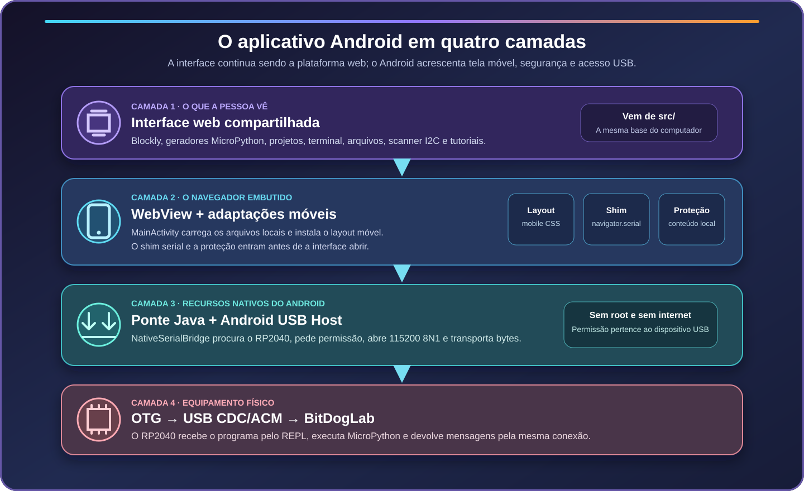
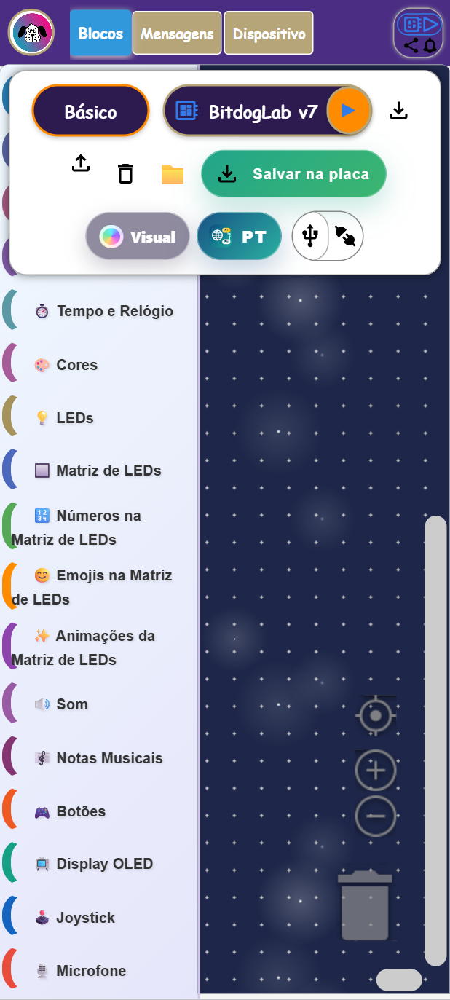
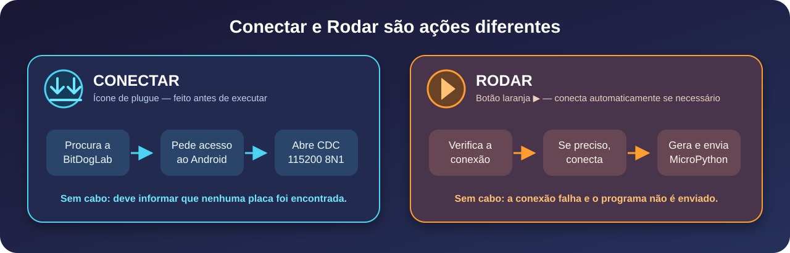
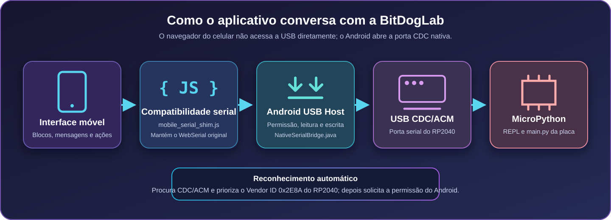
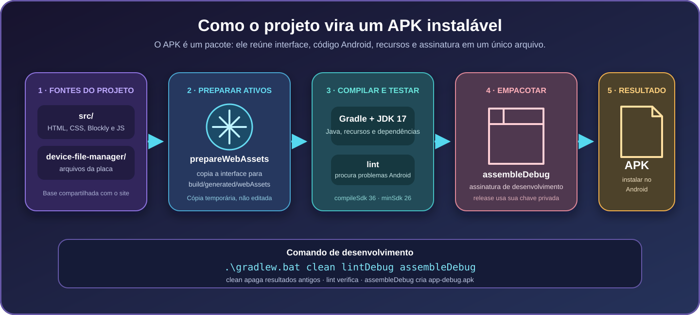

<div align="center">
  

  # BitDogLab-Blocos para Android

  **A mesma plataforma visual do computador, empacotada como aplicativo Android com comunicação USB CDC nativa.**

  
  
  
  
</div>

## O que foi criado

Este diretório transforma a plataforma web BIPES BitDogLab no aplicativo
**BitDogLab-Blocos**, atualmente na versão **0.3.1**, para instalação no
Android. Em termos simples, o projeto coloca o site dentro de uma
janela segura do Android, adapta a interface para telas pequenas e acrescenta
uma ligação nativa com a porta USB do celular.

Isso evita manter duas plataformas educacionais diferentes. Os blocos,
geradores MicroPython, projetos, mensagens, terminal, arquivos, scanner I2C e
tutoriais continuam vindo da aplicação web. O código Android cuida apenas do
que um navegador comum no celular não consegue fazer sozinho:

- mostrar a interface como um aplicativo;
- adaptar os controles para toque, retrato e paisagem;
- localizar a BitDogLab conectada por OTG;
- solicitar a autorização USB do Android;
- transportar os dados entre JavaScript e a porta serial da placa;
- empacotar tudo em um arquivo `.apk`.



### Uma comparação simples

Pense na plataforma web como o **conteúdo de um livro**. O aplicativo Android é
uma **capa com recursos extras**: ele organiza esse mesmo conteúdo para o
celular e adiciona o conector USB. Quando um bloco ou gerador é corrigido no
site, a mudança entra no próximo APK ao recompilar o projeto.

Não existe uma cópia manual da interface dentro do código Java. Durante a
compilação, o Gradle copia os arquivos web atuais para uma pasta temporária e
os coloca dentro do APK.

## Dicionário rápido para quem nunca criou um aplicativo

| Termo | Significado neste projeto |
| --- | --- |
| **APK** | Arquivo instalável do Android, semelhante a um pacote que reúne programa, imagens e configurações. |
| **Android SDK** | Conjunto de ferramentas usado para compilar e verificar aplicativos Android. |
| **Gradle** | Programa que automatiza a cópia dos arquivos, a compilação, os testes e a criação do APK. |
| **WebView** | Componente Android que mostra HTML, CSS e JavaScript dentro do aplicativo. |
| **Ponte nativa** | Código Java que recebe pedidos do JavaScript e acessa recursos do Android, neste caso a USB. |
| **Shim** | Pequena camada de compatibilidade que apresenta a ponte Android no formato de `navigator.serial`. |
| **USB Host / OTG** | Modo no qual o celular controla um equipamento USB conectado por adaptador. |
| **CDC/ACM** | Padrão USB que faz a BitDogLab aparecer como uma porta serial. |
| **REPL** | Terminal interativo do MicroPython usado para receber, executar e interromper código. |
| **Debug** | Versão para desenvolvimento e testes, assinada automaticamente pelo computador. |
| **Release** | Versão final de distribuição, que precisa de uma chave de assinatura permanente. |

## Site e aplicativo: o que muda

O site continua usando **Web Serial**. O aplicativo não usa WebUSB: ele acessa
a porta CDC/ACM do RP2040 pela API **USB Host nativa do Android**. Por isso não
é necessário instalar `webusb.py`, modificar `boot.py` ou preparar um firmware
especial na placa.

```text
Computador: navegador -> Web Serial -> USB CDC -> MicroPython
Android:    WebView -> shim serial -> ponte Android USB Host -> USB CDC -> MicroPython
```

O resultado visual e o MicroPython gerado são os mesmos. A principal diferença
está somente no caminho usado para chegar à porta USB.

### O que este projeto não usa

- Não foi criada uma segunda interface em Flutter ou React Native.
- Não há servidor intermediário, login ou armazenamento em nuvem.
- Não há comunicação por Bluetooth ou Wi-Fi.
- Não há WebUSB nem alteração especial no firmware MicroPython.
- Não há dependência de `file://`; a WebView usa uma origem HTTPS local e
  controlada pelo Android.

Essa escolha reduz duplicação: a equipe mantém os blocos e geradores em um só
lugar, enquanto o módulo Android permanece pequeno e concentrado em
empacotamento, interface móvel e USB.

## Interface no celular

As imagens abaixo foram capturadas da aplicação real em uma tela de 412 × 915
pixels. O layout móvel é acrescentado somente no APK e não altera o site.

<table>
  <tr>
    <td align="center"><strong>Área de blocos</strong></td>
    <td align="center"><strong>Painel de ferramentas</strong></td>
  </tr>
  <tr>
    <td></td>
    <td></td>
  </tr>
</table>

### Controles principais

| Controle | Função |
| --- | --- |
| **Blocos** | Abre a paleta e a área onde o programa é montado. |
| **‹ / › ao lado das categorias** | Recolhe ou mostra a paleta para liberar mais espaço para os blocos. |
| **Mensagens** | Mostra o terminal e a resposta recebida do MicroPython. |
| **Dispositivo** | Abre a referência da BitDogLab e os tutoriais de hardware. |
| **Ferramentas**, no canto superior direito | Abre e fecha o painel mostrado na segunda imagem. |
| **Básico / Robô / Estufa / Musical** | Seleciona o projeto e filtra as categorias disponíveis. |
| **BitDogLab v7 / v6** | Seleciona a configuração física e os blocos da versão da placa. |
| **Plugue** | Conecta ou desconecta manualmente a BitDogLab. |
| **USB** | Seleciona o canal serial; atualmente existe apenas o canal serial. |
| **▶ Rodar** | Gera o MicroPython e envia o programa. Se necessário, tenta conectar primeiro. |
| **Salvar na placa** | Grava o programa como `main.py`; também tenta conectar automaticamente. |
| **Mensagens → Parar programa** | Envia a interrupção para o MicroPython. |
| **Visual e PT/EN** | Alteram o tema e o idioma da interface. |

## Primeiro uso em seis passos

Para usar o aplicativo não é necessário conhecer Java, Android Studio ou
MicroPython internamente:

1. Instale o APK no celular.
2. Ligue o adaptador OTG ao celular.
3. Ligue a BitDogLab ao adaptador usando um cabo USB de dados.
4. Abra o aplicativo e aceite a janela de permissão USB do Android.
5. Monte um programa simples, como acender o LED RGB.
6. Toque em **▶ Rodar** e acompanhe o retorno na aba **Mensagens**.

Se o Android não mostrar a janela de permissão, confira primeiro o cabo e o
suporte OTG. Um cabo que apenas carrega energia acende a placa, mas não permite
que o aplicativo envie programas.

## Hardware necessário

- Celular ou tablet com Android 8.0 ou mais recente.
- Suporte a USB Host/OTG no aparelho Android.
- Adaptador OTG compatível com a conexão do celular.
- Cabo USB **de dados**; um cabo somente de energia não funciona.
- BitDogLab com o MicroPython padrão já usado no computador.

A ligação física é:

```text
Celular Android -> adaptador OTG -> cabo USB de dados -> BitDogLab
```

A bateria presente na BitDogLab não substitui o cabo de dados. Ela pode
alimentar a placa, mas o Android precisa da conexão USB para enviar e receber
informações.

## Conectar e Rodar



**Conectar** prepara o caminho USB. **Rodar** produz o programa e o envia por
esse caminho. O botão Rodar também tenta conectar automaticamente quando a
porta ainda não está aberta.


### Conexão manual

O botão de plugue procura uma porta serial USB. Quando encontra a BitDogLab, o
Android mostra sua própria janela solicitando autorização. Depois da
autorização, o aplicativo abre a porta e mantém a conexão disponível para
rodar, parar, salvar, usar o terminal, gerenciar arquivos e executar o scanner
I2C.

### Conexão automática ao rodar

Não é obrigatório tocar primeiro no plugue. Ao pressionar **▶ Rodar**, a
plataforma verifica se já existe uma conexão:

1. Se estiver conectada, gera e envia o programa imediatamente.
2. Se estiver desconectada, inicia a procura da BitDogLab.
3. O Android solicita a permissão USB quando necessário.
4. A plataforma aguarda até dois segundos e executa somente se a conexão tiver
   sido estabelecida.

O botão **Salvar na placa** usa a mesma tentativa automática antes de gravar o
`main.py`.

> **Sem cabo ou sem placa:** o aplicativo não tem para onde enviar o programa.
> O botão Rodar tenta conectar, mas não haverá execução nem resposta em
> Mensagens. Nesta versão, a falha de seleção pode ficar somente no log interno
> e parecer que nada aconteceu.

## Como a BitDogLab é reconhecida

O Android não trabalha com nomes como `COM3` ou `COM4`. O reconhecimento usa os
descritores do dispositivo USB:

1. O Android detecta o equipamento conectado ao adaptador OTG.
2. O aplicativo enumera os dispositivos com porta serial **CDC/ACM**.
3. Aceita o dispositivo com **Vendor ID `0x2E8A`** (`11914` em decimal),
   utilizado pelo RP2040/Raspberry Pi.
4. O sistema Android pede ao usuário a permissão de acesso ao dispositivo.
5. A primeira porta serial do dispositivo é aberta em **115200 baud, 8 bits,
   sem paridade e 1 stop bit — 8N1**.

Dispositivos CDC com outro Vendor ID são rejeitados. Essa restrição evita que o
aplicativo abra por engano um conversor serial ou outro equipamento conectado
ao mesmo hub.

O filtro Android que permite reconhecer a conexão física está em
[`device_filter.xml`](android/app/src/main/res/xml/device_filter.xml), e a
seleção completa ocorre em
[`NativeSerialBridge.java`](android/app/src/main/java/org/bitdoglab/bipes/NativeSerialBridge.java).

## Arquitetura da comunicação USB

A WebView não recebe acesso irrestrito ao Android. Ela conversa somente com
uma ponte chamada `BitDogLabUsbNative`, disponível na origem local segura do
aplicativo e apenas no frame principal. Essa ponte entende operações limitadas:
procurar a porta, abrir, escrever, interromper, executar uma transação de
arquivos e fechar.

Os dados de escrita são codificados em Base64 para atravessar a fronteira entre
JavaScript e Java sem perder bytes. Na volta, a ponte recebe os bytes da placa,
codifica-os novamente e avisa o shim. O shim transforma esses eventos em
`ReadableStream` e `WritableStream`, exatamente o formato que o código Web
Serial existente já sabe usar.



### Responsabilidade de cada camada

| Camada | Responsabilidade |
| --- | --- |
| Interface compartilhada | Blocos, geração de código, terminal, projetos, arquivos e scanner I2C. |
| `mobile_serial_shim.js` | Apresenta a conexão Android no formato de porta esperado pelo `webserial.js`. |
| `NativeSerialBridge.java` | Enumera USB, solicita permissão, abre CDC, lê, escreve e trata retirada do cabo. |
| Android USB Host | Fornece acesso ao dispositivo conectado por OTG, sem root. |
| CDC/ACM do RP2040 | Transporta os bytes da porta serial padrão da placa. |
| MicroPython | Executa o código, responde pelo REPL e carrega `main.py`. |

O arquivo Web Serial do site é empacotado no APK sem alterações. A
compatibilidade móvel é injetada antes de a interface iniciar, oferecendo:

```javascript
port.open({ baudRate: 115200 })
port.readable
port.writable
port.close()
```

Assim, o protocolo já usado no computador continua responsável por dividir os
dados em pacotes, reconhecer o prompt `>>>`, executar callbacks e controlar a
fila de transmissão.

## O que acontece em cada operação

### Rodar

1. Os blocos são convertidos para o mesmo MicroPython gerado no computador.
2. A conexão é aberta automaticamente se necessário.
3. O código é colocado na fila serial e enviado em ordem.
4. O aplicativo acompanha a resposta até o prompt `>>>` do REPL.
5. A saída recebida aparece em **Mensagens**.

### Parar

O fluxo serial envia `Ctrl+C` ao REPL para interromper o programa. O botão
laranja volta ao estado de execução quando a placa responde novamente.

### Como foi corrigido o ciclo Conectar → Rodar → Parar → Rodar

Durante o desenvolvimento da versão móvel apareceu um erro que parecia ser uma
desconexão física: o primeiro programa funcionava, mas, depois de tocar em
**Parar**, era necessário retirar e recolocar o cabo para executar novamente.
Em outra variação, o indicador conectava e desconectava rapidamente.

A causa estava no significado do byte `Ctrl+C` (`0x03`). Ele é usado em dois
momentos diferentes:

1. **Recuperação automática:** logo após abrir a porta, o aplicativo envia
   `Ctrl+C` para interromper um possível `main.py` e obter o prompt `>>>`.
2. **Parada manual:** enquanto um programa está rodando, o mesmo `Ctrl+C`
   interrompe o código a pedido do usuário.

Uma implementação anterior da ponte móvel tratava qualquer `Ctrl+C` como
parada manual. Por isso, o comando automático da própria conexão chamava
`runAbort()`, apagava o estado visual de conectado e deixava a interface
divergente da porta USB, que continuava fisicamente aberta. Ao tocar novamente
no plugue, a lógica encontrava a porta aberta e a desconectava de verdade.

Na versão **0.2.1**, `mobile_serial_shim.js` considera também o contexto:

- se o comando veio diretamente da recuperação inicial, mantém
  `connected = true`, não chama `runAbort()` e não fecha a porta;
- se o comando veio da fila criada pelo botão **Parar**, limpa somente os
  pacotes e callbacks da execução anterior;
- a confirmação real de que o MicroPython está pronto continua sendo o prompt
  `>>>` recebido da placa;
- o próximo programa reutiliza a mesma porta USB já autorizada.

Essa separação mantém três estados sincronizados: a porta nativa do Android, o
protocolo Web Serial compatível e os indicadores da interface. O teste
`automatic connection recovery does not imitate a disconnect in the interface`
protege esse comportamento contra regressões.

### Salvar na placa

O código é gravado como `main.py` usando o protocolo já existente. A rotina
envia o conteúdo, conclui o arquivo e verifica a quantidade de bytes gravados.
Na próxima inicialização, o MicroPython poderá executar esse arquivo.

### Terminal, arquivos e scanner I2C

Todas essas funções usam a mesma porta CDC já autorizada. Não são abertas
conexões USB separadas para cada ferramenta.

#### Por que o gerenciador de arquivos precisou de uma transação própria

No navegador do computador, a leitura assíncrona do Web Serial consegue
acompanhar normalmente os marcadores e o conteúdo enviados pelo MicroPython.
No Android, porém, a leitura assíncrona disputava os mesmos bytes com a rotina
que aguardava a listagem. Respostas maiores, como uma pasta com muitos CSVs,
podiam ser divididas ou consumidas parcialmente antes de chegar ao gerenciador.

A solução final ficou restrita ao aplicativo:

1. o shim solicita uma única transação nativa para a operação de arquivos;
2. a ponte pausa temporariamente o leitor serial assíncrono;
3. envia `Ctrl+B` e `Ctrl+C`, confirma o prompt normal `>>>` e só então envia o
   comando;
4. lê diretamente até o marcador final exclusivo daquela operação;
5. restaura o leitor assíncrono usado pelo terminal e pelas demais funções.

O MicroPython também recebe um intervalo inicial curto e transmite listas e
arquivos em blocos pequenos no Android. Isso evita que o buffer USB perca
partes de respostas extensas. Esses atrasos não são usados no navegador, que
continua no fluxo Web Serial anterior. Assim, listar pastas, abrir códigos e
visualizar CSVs funciona no aplicativo sem substituir a implementação já
funcional do computador.

## Instalação do APK de desenvolvimento

Se alguém já forneceu o APK pronto, não é necessário instalar ferramentas de
desenvolvimento no celular. Basta transferir o arquivo e abri-lo. Se o arquivo
ainda não existir, siga primeiro a seção **Compilar o aplicativo**.

O APK local fica em:

```text
src/mobile/android/app/build/outputs/apk/debug/app-debug.apk
```

Ele pode ser transferido para o celular e aberto pelo gerenciador de arquivos.
Como esse APK é instalado fora da Play Store e usa uma assinatura de
desenvolvimento, o Play Protect pode mostrar uma tela de verificação e a opção
**Instalar assim mesmo**. Esse aviso ocorre antes de o aplicativo executar e
não indica uma falha na comunicação USB.

Também é possível instalar por ADB:

```powershell
adb install -r .\src\mobile\android\app\build\outputs\apk\debug\app-debug.apk
```

Para distribuição pública sem o fluxo de desenvolvimento, será necessário
gerar uma versão release com uma chave definitiva e registrar/publicar o
pacote `org.bitdoglab.bipes` pelo canal de distribuição escolhido. A chave de
assinatura nunca deve ser salva no repositório.

### APK release assinado

O build de release exige uma chave particular fora do Git. Crie localmente
`src/mobile/android/keystore.properties` com referências para a chave:

```properties
storeFile=C:/caminho/seguro/bitdoglab-release.jks
storePassword=SENHA_LOCAL
keyAlias=bitdoglab
keyPassword=SENHA_LOCAL
```

O arquivo de propriedades, a chave e todos os APKs estão ignorados. Guarde uma
cópia segura da chave e da senha: futuras atualizações precisam da mesma
assinatura. Depois, gere o pacote final:

```powershell
cd src/mobile/android
.\gradlew.bat clean lintRelease assembleRelease
```

O resultado instalável fica em
`app/build/outputs/apk/release/app-release.apk`. A versão release desativa a
depuração da WebView, reduz o código nativo e preserva os ativos locais.

## Compilar o aplicativo

Compilar significa transformar os arquivos do repositório em um APK. O processo
não altera a plataforma web: ele cria cópias e resultados dentro das pastas de
build, que são ignoradas pelo Git.



### Requisitos de desenvolvimento

- JDK 17.
- Android SDK com a plataforma Android 36 instalada.
- Variável `ANDROID_HOME` configurada ou `android/local.properties` local.
- Node.js para executar os testes JavaScript.

### Primeira compilação, passo a passo

1. Abra o PowerShell na raiz do repositório.
2. Entre no projeto Android:

   ```powershell
   cd src/mobile/android
   ```

3. Execute a compilação de desenvolvimento:

   ```powershell
   .\gradlew.bat clean lintDebug assembleDebug
   ```

4. Aguarde a mensagem `BUILD SUCCESSFUL`.
5. Encontre o APK em:

   ```text
   app/build/outputs/apk/debug/app-debug.apk
   ```

Na primeira execução, o Gradle pode baixar ferramentas e dependências, por isso
o processo pode demorar mais. A internet é necessária no computador apenas
para esses downloads de desenvolvimento; o APK final não solicita permissão de
internet.

### O que cada parte do comando faz

| Parte | Resultado |
| --- | --- |
| `gradlew.bat` | Usa a versão de Gradle definida pelo próprio projeto. |
| `clean` | Remove resultados antigos para evitar que arquivos obsoletos entrem no APK. |
| `lintDebug` | Analisa manifest, recursos e código Android em busca de problemas. |
| `assembleDebug` | Compila, empacota e assina automaticamente o APK de teste. |

### Como a interface entra no APK

Durante o build, a tarefa `prepareWebAssets` lê `src/` e
`device-file-manager/` e cria uma cópia temporária em
`android/app/build/generated/webAssets/`. Essa pasta é ignorada pelo Git e é
removida por `gradlew clean`.

Não existe uma segunda interface mantida dentro do aplicativo: alterações
futuras nos blocos ou geradores entram no próximo APK quando ele for
recompilado.

O `MainActivity.java` abre a página local
`/assets/src/pages/index.html?mobile=1` usando
`WebViewAssetLoader`. Antes de a página iniciar, o Android instala quatro
adaptações:

1. `mobile_layout.css`, para tamanho, toque e áreas seguras;
2. `mobile_serial_shim.js`, para oferecer `navigator.serial`;
3. `mobile_content_hardening.js`, para tratar conteúdo variável como texto;
4. `mobile_workspace.js`, para recolher as categorias e ampliar o espaço de
   montagem.

Como `prepareWebAssets` faz uma cópia nova a cada compilação limpa, o APK inclui
o catálogo PT/EN e as traduções atuais da plataforma web. Não existe um catálogo
de idioma separado e desatualizado dentro do Android.

## Problemas comuns

| Sintoma | Causa provável | O que conferir |
| --- | --- | --- |
| A placa acende, mas não é encontrada | Cabo fornece energia, porém não transporta dados | Teste outro cabo USB de dados e outro adaptador OTG. |
| A janela de permissão não aparece | O Android não reconheceu o dispositivo USB | Retire e recoloque o cabo, desbloqueie a tela e abra novamente o aplicativo. |
| Aparece “Permissão USB negada” | A autorização foi recusada | Desconecte a placa, conecte novamente e aceite a solicitação. |
| Conecta e parece desconectar imediatamente | APK anterior confundia a recuperação automática com uma parada manual | Instale a versão 0.2.1 ou mais recente; não toque novamente no plugue enquanto a conexão está sendo preparada. |
| Rodar parece não fazer nada | A porta não abriu ou a placa não respondeu | Abra **Mensagens**, toque no plugue e observe o erro apresentado. |
| O aplicativo pede atualização da WebView | Faltam recursos de segurança usados pela ponte | Atualize **Android System WebView** ou o navegador do sistema. |
| O Gradle não encontra o SDK | `ANDROID_HOME` ou `local.properties` não aponta para o SDK | Configure o caminho do Android SDK no computador. |
| `assembleRelease` pede uma chave | A versão final não pode usar a assinatura de desenvolvimento | Crie `keystore.properties` e mantenha a chave fora do Git. |

## Estrutura do código móvel

```text
src/mobile/
├── README.md
├── docs/images/                         # capturas e diagramas deste guia
├── scripts/check-web-boundary.mjs       # protege os arquivos web estáveis
├── tests/mobile-serial-shim.test.js     # contrato e integração serial
├── web-boundary.json                    # hashes da fronteira web
└── android/
    └── app/src/main/
        ├── AndroidManifest.xml
        ├── java/org/bitdoglab/bipes/
        │   ├── MainActivity.java
        │   └── NativeSerialBridge.java
        └── res/
            ├── raw/mobile_layout.css
            ├── raw/mobile_serial_shim.js
            ├── raw/mobile_workspace.js
            └── xml/device_filter.xml
```

| Arquivo | Função |
| --- | --- |
| [`MainActivity.java`](android/app/src/main/java/org/bitdoglab/bipes/MainActivity.java) | Configura a WebView, os ativos locais, o layout móvel e a ponte JavaScript. |
| [`NativeSerialBridge.java`](android/app/src/main/java/org/bitdoglab/bipes/NativeSerialBridge.java) | Implementa a comunicação USB CDC nativa. |
| [`mobile_serial_shim.js`](android/app/src/main/res/raw/mobile_serial_shim.js) | Converte eventos Android em `ReadableStream` e `WritableStream`. |
| [`mobile_content_hardening.js`](android/app/src/main/res/raw/mobile_content_hardening.js) | Renderiza entradas variáveis como texto, impedindo injeção HTML no APK. |
| [`mobile_layout.css`](android/app/src/main/res/raw/mobile_layout.css) | Adapta cabeçalho, ferramentas, Blockly, retrato, paisagem e áreas seguras. |
| [`mobile_workspace.js`](android/app/src/main/res/raw/mobile_workspace.js) | Recolhe e restaura as categorias sob demanda e redimensiona o Blockly. |
| [`device_filter.xml`](android/app/src/main/res/xml/device_filter.xml) | Declara o Vendor ID do RP2040 para conexões USB. |
| [`mobile-serial-shim.test.js`](tests/mobile-serial-shim.test.js) | Testa permissão, abertura, leitura, escrita, desconexão e WebSerial original. |

## Isolamento e segurança

- O aplicativo não altera o `webserial.js` utilizado pelo site.
- A WebView carrega os arquivos por uma origem HTTPS local fornecida pelo
  `WebViewAssetLoader`, e não por `file://`.
- Acesso direto a arquivos e conteúdos do Android permanece desativado.
- O APK não solicita permissão de internet e bloqueia recursos HTTP externos.
- A ponte nativa aceita mensagens somente da origem local e do frame principal.
- Links HTTP, HTTPS e e-mail são enviados ao aplicativo externo apropriado;
  outros protocolos são rejeitados.
- O aplicativo aceita somente dispositivos USB com o Vendor ID do RP2040.
- Mensagens, blocos de escrita e velocidade serial são validados e limitados.
- A permissão USB termina quando o dispositivo é retirado.
- Backup automático, cookies, conteúdo misto e cache de rede estão desativados.
- Não são necessários root, Bluetooth, Wi-Fi ou servidor intermediário.
- O build Android não executa o deploy do site.

## Testes e validação

Na raiz do repositório:

```powershell
node src/mobile/scripts/check-web-boundary.mjs
node --test src/mobile/tests/*.test.js
npm test

cd src/mobile/android
.\gradlew.bat lintDebug assembleDebug lintRelease assembleRelease
```

O verificador de fronteira compara hashes de arquivos web sensíveis com
`web-boundary.json`. Se ele relatar uma alteração, isso não significa
automaticamente que o aplicativo está quebrado: significa que a mudança na
plataforma web precisa ser revisada antes de atualizar a linha de base. Não
substitua os hashes sem conferir o diff dos arquivos indicados.

As validações móveis cobrem:

- instalação da compatibilidade `navigator.serial`;
- seleção e rejeição de permissão;
- abertura em 115200 baud;
- escrita e leitura binária;
- parada prioritária e nova execução sem reconectar a porta;
- recolhimento e restauração das categorias no celular;
- retirada física e recuperação da interface;
- execução do `webserial.js` original sobre a ponte móvel;
- recebimento do prompt `>>>`;
- fechamento ordenado da conexão;
- preservação dos hashes da implementação web.
- ausência de permissão de internet e backup Android;
- isolamento da ponte na origem local e bloqueio de recursos externos;
- restrição ao VID da BitDogLab e limites das mensagens USB;
- proteção contra injeção HTML nas notificações móveis;
- regras que impedem chaves e pacotes compilados de entrarem no Git.

O teste automatizado não substitui a validação física. Antes de distribuir uma
versão, use um aparelho Android real, um adaptador OTG, um cabo de dados e uma
BitDogLab para conferir conexão, executar, parar, terminal, `main.py`, arquivos,
scanner I2C, retirada do cabo e reconexão.

## Referências técnicas

- [USB Host no Android](https://developer.android.com/develop/connectivity/usb/host)
- [WebViewAssetLoader](https://developer.android.com/reference/androidx/webkit/WebViewAssetLoader)
- [usb-serial-for-android](https://github.com/mik3y/usb-serial-for-android)
- [MicroPython para RP2](https://micropython.org/download/RPI_PICO/)
